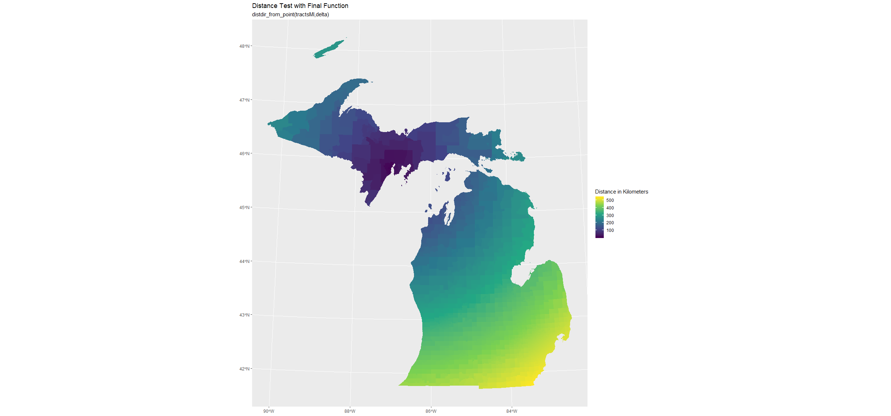

# what happens in the end?
### about
For my final project, I replicated the [QGIS model](qgis/qgisModeling.md) I created at the beginning of the semester to calculate distance and direction from a given point with SQL using R and various R packages such as sf, sp, tidyverse, and geosphere. This was all done in [RStudio](https://rstudio.com/). In short, I converted the SQL used in the QGIS model into a function in R. Similar to the QGIS model, the R function has three arguments/inputs: the input features, the layer from which distance and direction are calculated, and an optional character string to prefix the new columns for distance and direction.  As with the original model, the intended application of this function is to calculate the distance and direction of features within a city from the city center or central business district, though as can be seen with my focus on caluclating distance and direction between tracts and counties in Michigan, the applications for the model are not limited to cities and CBDs. [Here](r/distdirFunction.R) is the function in its entirety. I will undoubtedly add comments to it in the next two days or so. 
### the function: distdir_from_point()
```r
# commented code and other things should be added soon?
# this function is dependent on geosphere, tidyverse (mostly dplyr), sp, and sf
distdir_from_point <- function (layer, center, prefix = "") {
  if (missing(center)) {
    wgs84 <-
      layer %>%
      as("sf") %>%
      st_transform(3395) %>%
      st_geometry %>%
      st_centroid %>%
      st_transform(4326)
    cbd <-
      layer %>%
      as("sf") %>%
      st_transform(3395) %>%
      st_geometry %>%
      st_centroid %>%
      st_sf %>%
      mutate(nichts = "nichts") %>%
      group_by(nichts) %>%
      summarize %>%
      st_geometry %>%
      st_centroid %>%
      st_transform(4326)
    int <-
      layer %>%
      as("sf") %>%
      mutate(
        dist_unit = st_distance(wgs84, cbd),
        dist_double = as.double(st_distance(wgs84, cbd)),
        dir_degrees = (bearing(as_Spatial(cbd), as_Spatial(wgs84)) + 360) %% 360
      )
  } else {
    wgs84 <-
      layer %>%
      as("sf") %>%
      st_transform(3395) %>%
      st_geometry %>%
      st_centroid %>%
      st_transform(4326)
    cbd <-
      center %>%
      as("sf") %>%
      st_transform(3395) %>%
      st_geometry %>%
      st_centroid %>%
      st_sf %>%
      mutate(nichts = "nichts") %>%
      group_by(nichts) %>%
      summarize %>%
      st_geometry %>%
      st_centroid %>%
      st_transform(4326)
    int <- layer %>%
      as("sf") %>%
      mutate(
        dist_unit = st_distance(wgs84, cbd),
        dist_double = as.double(st_distance(wgs84, cbd)),
        dir_degrees = (bearing(as_Spatial(cbd), as_Spatial(wgs84)) + 360) %% 360
      )
  }
  result <- int %>%
    mutate(card_ord = ifelse(
      dir_degrees <= 22.5 |
        dir_degrees >= 337.5,
      "N",
      ifelse(
        dir_degrees <= 67.5 &
          dir_degrees >= 22.5,
        "NE",
        ifelse(
          dir_degrees <= 122.5 &
            dir_degrees >= 67.5,
          "E",
          ifelse(
            dir_degrees <= 157.5 &
              dir_degrees >= 112.5,
            "SE",
            ifelse(
              dir_degrees <= 292.5 &
                dir_degrees >= 247.5,
              "W",
              ifelse(
                dir_degrees <= 247.5 &
                  dir_degrees >= 202.5,
                "SW",
                ifelse(
                  dir_degrees <= 337.5 &
                    dir_degrees >= 292.5,
                  "NW",
                  ifelse(dir_degrees <= 202.5 &
                           dir_degrees >= 157.5, "S", "nirgendwo")
                )
              )
            )
          )
        )
      )
    ))
  if(prefix == ""){
    result 
  } else {
    result %>%
      rename(!! paste(prefix, "dist_unit", sep = "_"):= dist_unit) %>%
      rename(!! paste(prefix, "dist_double", sep = "_"):= dist_double) %>%
      rename(!! paste(prefix, "dir_degrees", sep = "_"):= dir_degrees) %>%
      rename(!! paste(prefix, "card_ord", sep = "_"):= card_ord)
  }
}
```
### sql translated to r
```sql
select distDir.*,
case
when [% @Prefix %]Dir<=22.5 or [% @Prefix %]Dir>=337.5 then 'N'
when [% @Prefix %]Dir<=67.5 and [% @Prefix %]Dir>=22.5 then 'NE'
when [% @Prefix %]Dir<=122.5 and [% @Prefix %]Dir>=67.5 then 'E'
when [% @Prefix %]Dir<=157.5 and [% @Prefix %]Dir>=112.5 then 'SE'
when [% @Prefix %]Dir<=292.5 and [% @Prefix %]Dir>=247.5 then 'W'
when [% @Prefix %]Dir<=247.5 and [% @Prefix %]Dir>=202.5 then 'SW'
when [% @Prefix %]Dir<=337.5 and [% @Prefix %]Dir>=292.5 then 'NW'
when [% @Prefix %]Dir<=202.5 and [% @Prefix %]Dir>=157.5 then 'S'
end [% @Prefix %]CardOrd
from (select *,
       distance(centroid(transform((geometry),4326)),transform((select geometry from input1),4326), true) as [% @Prefix %]Dist,
      degrees(azimuth(transform((select geometry from input1),3395), centroid(transform((geometry),3395)))) as [% @Prefix %]Dir
      from input2) as distDir
```
### [maps](maps.md)


### creating the function
The first step of making this function was to identify the packages I would need to use for this project, installing and loading them in RStudio when they were found. [Tidyverse](https://www.tidyverse.org/) was used because of the relative ease dplyr provides in manipulating data frames and ggplot2 to map results. I could have installed only these two packages from tidyverse, though I thought it would be best to play it safe as  the other packages which make up the tidyverse could also be of use. Along with tidyverse, [sf](https://r-spatial.github.io/sf/index.html) makes up the backbone of this function. Package sf provides simple features as data frames with a geometry list-column, which is a format I was familiar with coming from using tables in QGIS and PostGIS. It also has many of the geometry and geoemtric operations I need to make the function.     
```r
#### installation ####
install.packages("tidyverse","sf", "sp", "geosphere")

#### loading packages ####
library(tidyverse)
library(sf)
library(sp)
library(geosphere)
```
Initially, I thought that I would only need tidyverse and sf, though it soon became apparent that sf was not enough for what I was hoping to do and that I would need to use other packages to anaylze spatial data, these packages being [geosphere](https://cran.r-project.org/web/packages/geosphere/index.html) and [sp](https://cran.r-project.org/web/packages/sp/index.html), the package which it is dependent on. After these packages were loaded, the data being used for testing was loaded into RStudio using a function from sf. 
```r
tractsMI <- st_read(dsn = "censusMI.gpkg", layer = "tracts")
chicago <- st_read(dsn = "chicago.gpkg", layer = "tracts2010")
chicagoCBD <- st_read(dsn = "chicago.gpkg", layer = "CBD")
```
Rather than take on all the SQL at once, I decided to break it up into three manageable parts and begin by testing individual functions in dplyr and sf. Calculating distance was the first section to test and this was the SQL that needed to be converted in order to do that.
``` sql
distance(centroid(transform((geometry),4326)),transform((select geometry from input1),4326), true) as [% @Prefix %]Dist
```
The three functions used in the SQL  here were distance, transform, and centroid, so I needed to find and learn how to use thier equivalents in sf. The first of these I tried out was transform, or st_transform in sf. As stated on the sf website, all functions and methods in sf that  use spatial data have st_ as a prefix, which stands for spatial and temporal. I transformed tractsMI into WGS 84 to to test out st_transform. 
```r
View(tractsMI %>%
       st_transform(4326))
```
My next line of reasoning was to dissolve the tracts and create a centroid on the dissolved shape rather than try to caluclate mean coordinates (I stay with this for a while though I change to a different method which more closely resembles the SQL). Since sf didn't have a function to dissolve, I had to look elsewhere to learn how. I found two ways to dissolve from [Phil Mike Jones](https://philmikejones.me/tutorials/2015-09-03-dissolve-polygons-in-r/) on his website and tested them out.
```r
tractsMI$area <- st_area(tractsMI)

michigan <-
  tractsMI %>%
  summarize(area = sum(area))

ggplot(michigan2) + geom_sf()

# OR

michigan <-
  tractsMI %>%
  mutate(state = "michigan") %>%
  group_by(state) %>%
  summarize()

ggplot(michigan) + geom_sf()
```
I mapped each result to see if they dissolved and then went on to test st_centroid.  
```r
centroidTracts <- st_centroid(tractsMI)
```
There was warning when creating centroids which I largely igorned, though this will be resovled later.
```r
Warning message:
In st_centroid.sf(tractsMI) :
  st_centroid assumes attributes are constant over geometries of x
```
Ignoring this  warning message, I went on to make test out making centroids on dissolved shapes.  

```r
# from sf package
center <-
  tractsMI %>%
  mutate(area = st_area(tractsMI)) %>%
  summarize(area = sum(area)) %>%
  st_centroid()

# from geosphere package
center <-
  tractsMI %>%
  mutate(area = st_area(tractsMI)) %>%
  summarize(area = sum(area)) %>%
  as_Spatial() %>%
  centroid()

# alternate way to dissolve
center <-
  tractsMI %>%
  mutate(nichts = "nichts") %>%
  group_by(nichts) %>%
  summarize() %>%
  st_centroid()
```
Both geosphere and sf have functions to create centroids, though I ended up using st_centroid from sf because it was less of a hassle to use. Centroid from geosphere first needed the object to be converted to having a spatial class and the ouput of the function were x,y coordinates which then needed to be made into a point. Having already loaded the objects into R using sf and them being simple features, sticking with sf functions appeared to be the best way to go since it requires the least amount of effort. The next step was testing out st_distance to calculate the distance between the centroid of Michigan and its tracts. 
```r
View(st_distance(centroidTracts, center))
```
With these three functions figured out (other than warning  message for st_centroid), I set out to create a function to calculate distance from the centroid of Michigan.
```r
distTest <- function(layer) {
  tbd <- layer %>%
    #transforming to wgs 84 and adding a field to base the dissolve
    st_transform(4326) %>%
    mutate(area = st_area(layer))
  #dissolving layer and making a centroid on dissolved shape
  center <-
    tbd %>%
    summarize(area = sum(area)) %>%
    st_centroid()
  result <- tbd %>%
  # centroids are made on tbd and distance is calculated 
    mutate(dist = as.double(st_distance(st_centroid(tbd), center)))
}
```
Like the original model, I transformed the layer before calculating distance. Two objects are created in this object before calculating the result, tbd, which is the transformed input with a field to dissolve on and center, the centroid made on the dissolved input. As.double makes the data type of the st_distance's result as a double. This was done because before the output was a list with the distance and unit of measurement in one field and I could not do other calculations with it in this form. I wanted to get a handle on using more pipes in functions after making distTest to make it more streamlined.
```r
#### pipe dreams / testing pipes in R ####
central <-
  tractsMI %>%
  st_transform(4326) %>%
  mutate(area = st_area(tractsMI)) %>%
  summarize(area = sum(area)) %>%
  st_centroid()
```
With this newfound pipe knowledge, I went on to create a distance function with two arguments. One argument would act as the input features and the other argument would be the point from which distance is calculated.
```r
distTest2 <- function (layer, center) {
  # center is an optional argument to add a point or polygon(s) from which to calculate distance and direction
  # if center is missing, a centroid is made on the layer input and distance is calculated from it
  if (missing(center)) {
    wgs84 <-
      layer %>%
      st_transform(4326) %>%
      mutate(area = st_area(layer))
    cbd <-
      wgs84 %>%
      summarize(area = sum(area)) %>%
      st_centroid()
    result <-
      wgs84 %>%
      mutate(dist = as.double(st_distance(st_centroid(wgs84), cbd)))
  } else {
    wgs84 <-
      layer %>% st_transform(4326)
    cbd <-
      center %>%
      st_transform(4326) %>%
      mutate(area = st_area(center)) %>%
      summarize(area = sum(area)) %>%
      st_centroid()
    result <- wgs84 %>%
      mutate(dist = as.double(st_distance(st_centroid(wgs84), cbd)))
  }
}
```
An if-else statement is used in this function to allow for more variability. If the an object is inputted as center, distance will be calculated from it. If nothing is supplied, a centroid is made on the sole input and distance is calculated from it.
```r
result <- wgs84 %>%
  mutate(
        dist_unit = st_distance(st_centroid(wgs84), cbd),
        dist_double = as.double(st_distance(st_centroid(wgs84), cbd))
      )
```
Minor changes were made to the result of this function to create two columns for distance, one column with distance and the unit of measurement and one column with just the value. This new function was named dist_from_point. Having been somewhat successful calculating distance with distTest and then dist_from_point, I continued to try to calculate direction and convert the next line of SQL.
```sql
degrees(azimuth(transform((select geometry from input1),3395), centroid(transform((geometry),3395)))) as [% @Prefix %]Dir
```
Because I wanted to try to stick with sf functions for as long as possible, I thought I should try to use st_geod_azimuth from the sf package. Unfortunately, I was unable to find a way to supply more than one argument to it. This is where geosphere and sp come into play. The bearing function from geosphere was chosen to caluclate distance. 
```r
View((bearing(
  as_Spatial(st_transform(centroidTracts, 4326)), as_Spatial(st_transform(center, 4326))
) + 360) %% 360)
```
This was the result of my testing with the bearing function. Using baring wasn't as straightforward as st_distance and required more tinkering to get it working. Firstly, geosphere functions require objects to have "spatial" class. Sf objects need to be given this class with the function as_Spatial. Secondly, bearing requires geometries to be in lat/long, which is why the objects were transformed to EPSG:4326 rather than EPSG:3395. Both are WGS 84, however. 4326 is geographic (lat/long) while 3395 is projected. Lastly, bearing gives answers in degrees ranging from 180 to -180, so modular division was needed and used to make the answers from 0 to 360 degrees. After testing it in a function by itself, I added bearing to the dist_from_point function to make distdir_from_point.
```r
distdir_from_point <- function (layer, center) {
  if (missing(center)) {
    wgs84 <-
      layer %>%
      st_transform(4326) %>%
      mutate(area = st_area(layer))
    cbd <-
      wgs84 %>%
      summarize(area = sum(area)) %>%
      st_centroid()
    result <-
      wgs84 %>%
      mutate(
        dist_unit = st_distance(st_centroid(wgs84), cbd),
        dist_double = as.double(st_distance(st_centroid(wgs84), cbd)),
        dir_degrees = (bearing(
          as_Spatial(cbd), as_Spatial(st_centroid(wgs84))
        ) + 360) %% 360
      )
  } else {
    wgs84 <-
      layer %>% st_transform(4326)
    cbd <-
      center %>%
      st_transform(4326) %>%
      mutate(area = st_area(center)) %>%
      summarize(area = sum(area)) %>%
      st_centroid()
    result <- wgs84 %>%
      mutate(
        dist_unit = st_distance(st_centroid(wgs84), cbd),
        dist_double = as.double(st_distance(st_centroid(wgs84), cbd)),
        dir_degrees = (bearing(
          as_Spatial(cbd), as_Spatial(st_centroid(wgs84))
        ) + 360) %% 360
      )
  }
}
```
I next had to assign cardinal and ordinal directions to the dir_degree result and convert this block of SQL. 
```r
case
when [% @Prefix %]Dir<=22.5 or [% @Prefix %]Dir>=337.5 then 'N'
when [% @Prefix %]Dir<=67.5 and [% @Prefix %]Dir>=22.5 then 'NE'
when [% @Prefix %]Dir<=122.5 and [% @Prefix %]Dir>=67.5 then 'E'
when [% @Prefix %]Dir<=157.5 and [% @Prefix %]Dir>=112.5 then 'SE'
when [% @Prefix %]Dir<=292.5 and [% @Prefix %]Dir>=247.5 then 'W'
when [% @Prefix %]Dir<=247.5 and [% @Prefix %]Dir>=202.5 then 'SW'
when [% @Prefix %]Dir<=337.5 and [% @Prefix %]Dir>=292.5 then 'NW'
when [% @Prefix %]Dir<=202.5 and [% @Prefix %]Dir>=157.5 then 'S'
end [% @Prefix %]CardOrd
```
I used a string of ifelse functions to replicate this case statement. 
```r
dirtesting <- distdir_from_point(tractsMI)
View(dirtesting %>%
       mutate(card_ord = ifelse(
         dir_degrees <= 22.5 |
           dir_degrees >= 337.5,
         "N",
         ifelse(
           dir_degrees <= 67.5 &
             dir_degrees >= 22.5,
           "NE",
           ifelse(
             dir_degrees <= 122.5 &
               dir_degrees >= 67.5,
             "E",
             ifelse(
               dir_degrees <= 157.5 &
                 dir_degrees >= 112.5,
               "SE",
               ifelse(
                 dir_degrees <= 292.5 &
                   dir_degrees >= 247.5,
                 "W",
                 ifelse(
                   dir_degrees <= 247.5 &
                     dir_degrees >= 202.5,
                   "SW",
                   ifelse(
                     dir_degrees <= 337.5 &
                       dir_degrees >= 292.5,
                     "NW",
                     ifelse(dir_degrees <= 202.5 &
                              dir_degrees >= 157.5, "S", "nichts")
                   )
                 )
               )
             )
           )
         )
       )))
```
This  was then added to to distdir_from_point to create what I thought would be the final form of the function. 
```r
distdir_from_point <- function (layer, center) {
  if (missing(center)) {
    wgs84 <-
      layer %>%
      st_transform(4326) %>%
      mutate(area = st_area(layer))
    cbd <-
      wgs84 %>%
      summarize(area = sum(area)) %>%
      st_centroid()
    int <-
      wgs84 %>%
      mutate(
        dist_unit = st_distance(st_centroid(wgs84), cbd),
        dist_double = as.double(st_distance(st_centroid(wgs84), cbd)),
        dir_degrees = (bearing(
          as_Spatial(cbd), as_Spatial(st_centroid(wgs84))
        ) + 360) %% 360
      )
  } else {
    wgs84 <-
      layer %>% st_transform(4326)
    cbd <-
      center %>%
      st_transform(4326) %>%
      mutate(area = st_area(center)) %>%
      summarize(area = sum(area)) %>%
      st_centroid()
    int <- wgs84 %>%
      mutate(
        dist_unit = st_distance(st_centroid(wgs84), cbd),
        dist_double = as.double(st_distance(st_centroid(wgs84), cbd)),
        dir_degrees = (bearing(
          as_Spatial(cbd), as_Spatial(st_centroid(wgs84))
        ) + 360) %% 360
      )
  }
  result <- int %>%
    mutate(card_ord = ifelse(
      dir_degrees <= 22.5 |
        dir_degrees >= 337.5,
      "N",
      ifelse(
        dir_degrees <= 67.5 &
          dir_degrees >= 22.5,
        "NE",
        ifelse(
          dir_degrees <= 122.5 &
            dir_degrees >= 67.5,
          "E",
          ifelse(
            dir_degrees <= 157.5 &
              dir_degrees >= 112.5,
            "SE",
            ifelse(
              dir_degrees <= 292.5 &
                dir_degrees >= 247.5,
              "W",
              ifelse(
                dir_degrees <= 247.5 &
                  dir_degrees >= 202.5,
                "SW",
                ifelse(
                  dir_degrees <= 337.5 &
                    dir_degrees >= 292.5,
                  "NW",
                  ifelse(dir_degrees <= 202.5 &
                           dir_degrees >= 157.5, "S", "nichts")
                )
              )
            )
          )
        )
      )
    ))
}
```
Given the warning messages I got every time I used the function, more was needed to be done to fix the function. These were the warning messages from st_centroid which needed to be resolved .
```r
Warning: st_centroid does not give correct centroids for longitude/latitude data
Warning message:
In st_centroid.sf(.) :
st_centroid assumes attributes are constant over geometries of x
```
To fix the first warning, the object was transformed into a projected mercator (3395) before being made into a centroid. The second warning was fixed by supplying only the geometries of the layer to st_centroid using st_geometry. This is similar to the SQL where only the geometries are used in the functions rather the whole layer being piped through. The centroids are then transformed to EPSG:4326. 
```r
test <- tractsMI %>%
  st_transform(3395) %>%
  st_geometry %>%
  st_centroid() %>%
  st_transform(4326)
```
I made several changes to the main function after removing these errors. Rather than make the centroids for WGS 84 within the distance function, I made wgs84 centroids instead of just a transformed layer. Int, the intermediate layer, was also changed to have the intial layer input instead of wgs84 be piped to mutate. This means that output will have the original CRS of the input layer rather than EPSG:4326 though distance and direction will still be calculated with this.  
```r
 distdir_from_point <- function (layer, center) {
  if (missing(center)) {
    wgs84 <-
      layer %>%
      st_transform(3395) %>%
      # I removed the parentheses because I realized they weren't necessary
      st_geometry %>%
      st_centroid %>%
      st_transform(4326)
    cbd <-
      layer %>%
      mutate(nichts = "nichts") %>%
      group_by(nichts) %>%
      summarize %>%
      st_transform(3395) %>%
      st_geometry %>%
      st_centroid %>%
      st_transform(4326)
    int <-
      layer %>%
      mutate(
        dist_unit = st_distance(wgs84, cbd),
        dist_double = as.double(st_distance(wgs84, cbd)),
        dir_degrees = (bearing(as_Spatial(cbd), as_Spatial(wgs84)) + 360) %% 360
      )
  } else {
    wgs84 <-
      layer %>%
      st_transform(3395) %>%
      st_geometry %>%
      st_centroid %>%
      st_transform(4326)
    cbd <-
      center %>%
      mutate(nichts = "nichts") %>%
      group_by(nichts) %>%
      summarize %>%
      st_transform(3395) %>%
      st_geometry %>%
      st_centroid %>%
      st_transform(4326)
    int <- layer %>%
      mutate(
        dist_unit = st_distance(wgs84, cbd),
        dist_double = as.double(st_distance(wgs84, cbd)),
        dir_degrees = (bearing(as_Spatial(cbd), as_Spatial(wgs84)) + 360) %% 360
      )
  }
  result <- int %>%
    mutate(card_ord = ifelse(
      dir_degrees <= 22.5 |
        dir_degrees >= 337.5,
      "N",
      ifelse(
        dir_degrees <= 67.5 &
          dir_degrees >= 22.5,
        "NE",
        ifelse(
          dir_degrees <= 122.5 &
            dir_degrees >= 67.5,
          "E",
          ifelse(
            dir_degrees <= 157.5 &
              dir_degrees >= 112.5,
            "SE",
            ifelse(
              dir_degrees <= 292.5 &
                dir_degrees >= 247.5,
              "W",
              ifelse(
                dir_degrees <= 247.5 &
                  dir_degrees >= 202.5,
                "SW",
                ifelse(
                  dir_degrees <= 337.5 &
                    dir_degrees >= 292.5,
                  "NW",
                  ifelse(dir_degrees <= 202.5 &
                           dir_degrees >= 157.5, "S", "nichts")
                )
              )
            )
          )
        )
      )
    ))
}
``` 


***to be continued***

### data sources

### software 
[RStudio](https://rstudio.com/)

#### packages 
[tidyverse](https://www.tidyverse.org/)

[sf](https://r-spatial.github.io/sf/index.html)

[sp](https://cran.r-project.org/web/packages/sp/index.html)

[geosphere](https://cran.r-project.org/web/packages/geosphere/index.html)

