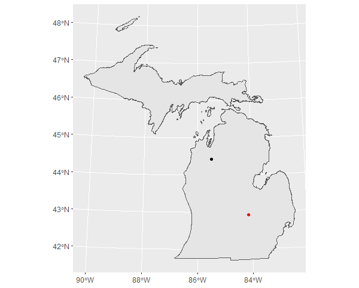

# what happens in the end?
### a brief exploration of the geospatial capabilities of r 
----------------------------------------------------------
### about
For my final project, I replicated the [QGIS model](qgis/qgisModeling.md) I created at the beginning of the semester using R and various R packages such as ``sf``, ``sp``, ``tidyverse``, and ``geosphere``. This was all done in [RStudio](https://rstudio.com/). In short, I converted the SQL used in the QGIS model into a function in R. Similar to the QGIS model, the R function has three arguments/inputs: the input features, the layer from which distance and direction are calculated, and an optional character string to prefix the new columns for distance and direction (input, origin, and prefix). Distance is calculated in meters and direction in degrees. The function can be found [here](r/distdir_from_point.R) and the entire process, failures and all, can be found in this [R script](r/final.R).

### the function: ``distdir_from_point(input, origin, prefix)``
```r
#### distdir_from_point ####

# this function calculates distance in meters and direction in degrees from an origin (origin) to a destination (input)
# this function is dependent on geosphere, tidyverse (mostly dplyr), sp, and sf
# written by kufre u.

##### packages ####
install.packages("geosphere")
install.packages("tidyverse")
install.packages("sf")
install.packages("sp")

library(tidyverse)
library(sf)
library(sp)
library(geosphere)

#### final function ####
distdir_from_point <- function (input, origin, prefix = "") {
  # input: destination layer. input also becomes the origin layer if origin is not supplied can either be an sf object or an object with a spatial class (sf preferred, must be a polygon or point)
  # origin: origin layer / where distance and direction are calculated from. can either be an sf object or an object with a spatial class (sf preferred, must be a polygon or point)
  # prefix: customizable prefix, must be a character string in quotes
  
  # example uses:
  # distdir_from_point(tracts, city_center, "cbd" )
  # distdir_from_point(input = tracts, origin = city_center, prefix = "cbd")
  # unless the arguments are clearly defined as they are in the second example, the inputs should always be written in the order input, origin, then prefix
  
  if (missing(origin)) {
    # this section calculates distance/directon from input if origin is not supplied
    wgs84 <- # destination layer, centroid made on each feature  
      input %>%
      as("sf") %>% # coerces objects with spatial class into sf objects
      st_transform(3395) %>% # transforms input into WGS 84  (projected coordinate system)
      st_geometry %>% # gets geometry from the object as a list to be used with st_centroid 
      st_centroid %>%
      st_transform(4326) # transforms input into WGS 84 (geographic coordinate system)
    cbd <- # point made from mean coordinates of centroids 
      input %>%
      as("sf") %>%
      st_transform(3395) %>%
      st_geometry %>%
      st_centroid %>% # creating a layer of centroids 
      st_sf %>% # this creates an sf object/data frame from the list of geometries made in st_geometry
      mutate(nichts = "nichts") %>% # creating a column to dissolve on  
      group_by(nichts) %>%
      summarize %>% # grouping by new field and dissolving centroids into a single geometry 
      st_geometry %>%
      st_centroid %>% # making centroid from a multipoint feature 
      st_transform(4326)
    int <-
      input %>%
      as("sf") %>%
      mutate(
        dist_unit = st_distance(wgs84, cbd), # unaltered output of st_distance (meters)
        dist_double = as.double(st_distance(wgs84, cbd)), # distance as a double (in meters, though unit is not shown with number) 
        dir_degrees = (bearing(as_Spatial(cbd), as_Spatial(wgs84)) + 360) %% 360 #  direction (in degrees, 0-360), objects need to be given the spatial class to be used with bearing and other geosphere functions
      )
  } else {
    # this section calculates distance/direction from origin if it is supplied 
    wgs84 <-
      input %>%
      as("sf") %>%
      st_transform(3395) %>%
      st_geometry %>%
      st_centroid %>%
      st_transform(4326)
    cbd <-
      origin %>% # input is replaced with origin here 
      as("sf") %>%
      st_transform(3395) %>%
      st_geometry %>%
      st_centroid %>%
      st_sf %>%
      mutate(nichts = "nichts") %>%
      group_by(nichts) %>%
      summarize %>%
      st_geometry %>%
      st_centroid %>%
      st_transform(4326)
    int <- input %>%
      as("sf") %>%
      mutate(
        dist_unit = st_distance(wgs84, cbd),
        dist_double = as.double(st_distance(wgs84, cbd)),
        dir_degrees = (bearing(as_Spatial(cbd), as_Spatial(wgs84)) + 360) %% 360
      )
  }
  result <- int %>%
    # assigning cardinal/ordinal directions to dir_degrees
    mutate(card_ord = ifelse(
      dir_degrees <= 22.5 |
        dir_degrees >= 337.5,
      "N",
      ifelse(
        dir_degrees <= 67.5 &
          dir_degrees >= 22.5,
        "NE",
        ifelse(
          dir_degrees <= 122.5 &
            dir_degrees >= 67.5,
          "E",
          ifelse(
            dir_degrees <= 157.5 &
              dir_degrees >= 112.5,
            "SE",
            ifelse(
              dir_degrees <= 292.5 &
                dir_degrees >= 247.5,
              "W",
              ifelse(
                dir_degrees <= 247.5 &
                  dir_degrees >= 202.5,
                "SW",
                ifelse(
                  dir_degrees <= 337.5 &
                    dir_degrees >= 292.5,
                  "NW",
                  ifelse(dir_degrees <= 202.5 &
                           dir_degrees >= 157.5, "S", "nichts")
                )
              )
            )
          )
        )
      )
    ))
  # adding prefixes
  if (prefix == "") {
    result # result is returned if no prefix is given 
  } else {
    result %>%
      rename(!!paste(prefix, "dist_unit", sep = "_") := dist_unit) %>%
      rename(!!paste(prefix, "dist_double", sep = "_") := dist_double) %>%
      rename(!!paste(prefix, "dir_degrees", sep = "_") := dir_degrees) %>%
      rename(!!paste(prefix, "card_ord", sep = "_") := card_ord)
  }
}
```
### sql translated to r
```sql
select distDir.*,
case
when [% @Prefix %]Dir<=22.5 or [% @Prefix %]Dir>=337.5 then 'N'
when [% @Prefix %]Dir<=67.5 and [% @Prefix %]Dir>=22.5 then 'NE'
when [% @Prefix %]Dir<=122.5 and [% @Prefix %]Dir>=67.5 then 'E'
when [% @Prefix %]Dir<=157.5 and [% @Prefix %]Dir>=112.5 then 'SE'
when [% @Prefix %]Dir<=292.5 and [% @Prefix %]Dir>=247.5 then 'W'
when [% @Prefix %]Dir<=247.5 and [% @Prefix %]Dir>=202.5 then 'SW'
when [% @Prefix %]Dir<=337.5 and [% @Prefix %]Dir>=292.5 then 'NW'
when [% @Prefix %]Dir<=202.5 and [% @Prefix %]Dir>=157.5 then 'S'
end [% @Prefix %]CardOrd
from (select *,
       distance(centroid(transform((geometry),4326)),transform((select geometry from input1),4326), true) as [% @Prefix %]Dist,
      degrees(azimuth(transform((select geometry from input1),3395), centroid(transform((geometry),3395)))) as [% @Prefix %]Dir
      from input2) as distDir
```
### [maps](maps.md)


### [creating the function](r/final.R)
The first step of making this function was to identify the packages I would need to use for this project, installing and loading them in RStudio when they were found. ``tidyverse`` was used because of the relative ease `dplyr` provides in manipulating data frames and ``ggplot2`` to map results. I could have installed only these two packages from `tidyverse`, though I thought it would be best to play it safe as  the other packages which make up the tidyverse could also be of use. Along with tidyverse, `sf` makes up the backbone of this function. Package ``sf`` provides simple features as data frames with a geometry list-column, which is a format I was familiar with coming from using tables in QGIS and PostGIS. It also has many of the geometry and geoemtric operations I need to make the function.     
```r
#### installation ####
install.packages("tidyverse","sf", "sp", "geosphere")

#### loading packages ####
library(tidyverse)
library(sf)
library(sp)
library(geosphere)
```
Initially, I thought that I would only need `tidyverse` and `sf`, though it soon became apparent that sf was not enough for what I was hoping to do and that I would need to use other packages to anaylze spatial data, these packages being `geosphere` and `sp`, the package which it is dependent on. After these packages were loaded, the data being used for testing was loaded into RStudio using a function from `sf`. 
```r
tractsMI <- st_read(dsn = "censusMI.gpkg", layer = "tracts")
chicago <- st_read(dsn = "chicago.gpkg", layer = "tracts2010")
chicagoCBD <- st_read(dsn = "chicago.gpkg", layer = "CBD")
```
Rather than take on all the SQL at once, I decided to break it up into three manageable parts and begin by testing individual functions in `dplyr` and `sf`. Calculating distance was the first section to test and this was the SQL that needed to be converted in order to do that.
``` sql
distance(centroid(transform((geometry),4326)),transform((select geometry from input1),4326), true) as [% @Prefix %]Dist
```
The three functions used in the SQL  here were distance, transform, and centroid, so I needed to find and learn how to use thier equivalents in `sf`. The first of these I tried out was transform, or `st_transform` in `sf`. As stated on the `sf` [website](https://r-spatial.github.io/sf/index.html), all functions and methods in `sf` that use spatial data have st_ as a prefix, which stands for spatial and temporal or spacetime. I transformed tractsMI into WGS 84 to to test out `st_transform`. 
```r
View(tractsMI %>%
       st_transform(4326))
```
My next line of reasoning was to dissolve the tracts and create a centroid on the dissolved shape rather than try to caluclate mean coordinates (I stay with this for a while though I change to a different method which more closely resembles the SQL). Since `sf` didn't have a function to dissolve, I had to look elsewhere to learn how. I found two ways to dissolve from [Phil Mike Jones](https://philmikejones.me/tutorials/2015-09-03-dissolve-polygons-in-r/) on his website and tested them out.
```r
tractsMI$area <- st_area(tractsMI)

michigan <-
  tractsMI %>%
  summarize(area = sum(area))

ggplot(michigan2) + geom_sf()

# OR

michigan <-
  tractsMI %>%
  mutate(state = "michigan") %>%
  group_by(state) %>%
  summarize()

ggplot(michigan) + geom_sf()
```
I mapped each result to see if they dissolved and then went on to test `st_centroid`.  
```r
centroidTracts <- st_centroid(tractsMI)
```
There was warning when creating centroids which I largely igorned, though this will be resovled later.
```r
Warning message:
In st_centroid.sf(tractsMI) :
  st_centroid assumes attributes are constant over geometries of x
```
Ignoring this  warning message, I went on to make test out making centroids on dissolved shapes.  

```r
# from sf package
center <-
  tractsMI %>%
  mutate(area = st_area(tractsMI)) %>%
  summarize(area = sum(area)) %>%
  st_centroid()

# from geosphere package
center <-
  tractsMI %>%
  mutate(area = st_area(tractsMI)) %>%
  summarize(area = sum(area)) %>%
  as_Spatial() %>%
  centroid()

# alternative way to dissolve
center <-
  tractsMI %>%
  mutate(nichts = "nichts") %>%
  group_by(nichts) %>%
  summarize() %>%
  st_centroid()
```
Both `geosphere` and `sf` have functions to create centroids, though I ended up using `st_centroid` from `sf` because it was less of a hassle to use. `centroid` from `geosphere` first needed the object to be converted to having a spatial class and the ouput of the function were x,y coordinates which then needed to be made into a point. Having already loaded the objects into R using `sf` and them being simple features, sticking with `sf` functions appeared to be the best way to go since it requires the least amount of effort. The next step was testing out `st_distance` to calculate the distance between the centroid of Michigan and its tracts. 
```r
View(st_distance(centroidTracts, center))
```
With these three functions figured out (other than warning  message for `st_centroid`), I set out to create a function to calculate distance from the centroid of Michigan.
```r
distTest <- function(layer) {
  tbd <- layer %>%
    #transforming to wgs 84 and adding a field to base the dissolve
    st_transform(4326) %>%
    mutate(area = st_area(layer))
  #dissolving layer and making a centroid on dissolved shape
  center <-
    tbd %>%
    summarize(area = sum(area)) %>%
    st_centroid()
  result <- tbd %>%
  # centroids are made on tbd and distance is calculated 
    mutate(dist = as.double(st_distance(st_centroid(tbd), center)))
}
```
Like the original model, I transformed the layer before calculating distance. Two objects are created in this object before calculating the result, tbd, which is the transformed input with a field to dissolve on and center, the centroid made on the dissolved input. `as.double` makes the data type of the `st_distance` result a double. This was done because before the output was a list with the distance and unit of measurement in one field and I could not do other calculations with it in this form. I wanted to get a handle on using more pipes in functions after making distTest to make it more streamlined.
```r
#### pipe dreams / testing pipes in R ####
central <-
  tractsMI %>%
  st_transform(4326) %>%
  mutate(area = st_area(tractsMI)) %>%
  summarize(area = sum(area)) %>%
  st_centroid()
```
With this newfound pipe knowledge, I went on to create a distance function with two arguments. One argument would act as the input features and the other argument would be the point from which distance is calculated.
```r
distTest2 <- function (layer, center) {
  # center is an optional argument to add a point or polygon(s) from which to calculate distance and direction
  # if center is missing, a centroid is made on the layer input and distance is calculated from it
  if (missing(center)) {
    wgs84 <-
      layer %>%
      st_transform(4326) %>%
      mutate(area = st_area(layer))
    cbd <-
      wgs84 %>%
      summarize(area = sum(area)) %>%
      st_centroid()
    result <-
      wgs84 %>%
      mutate(dist = as.double(st_distance(st_centroid(wgs84), cbd)))
  } else {
    wgs84 <-
      layer %>% st_transform(4326)
    cbd <-
      center %>%
      st_transform(4326) %>%
      mutate(area = st_area(center)) %>%
      summarize(area = sum(area)) %>%
      st_centroid()
    result <- wgs84 %>%
      mutate(dist = as.double(st_distance(st_centroid(wgs84), cbd)))
  }
}
```
An if-else statement is used in this function to allow for more flexibility. If the an object is inputted as center, distance will be calculated from it. If nothing is supplied, a centroid is made on the sole input and distance is calculated from it.
```r
result <- wgs84 %>%
  mutate(
        dist_unit = st_distance(st_centroid(wgs84), cbd),
        dist_double = as.double(st_distance(st_centroid(wgs84), cbd))
      )
```
Minor changes were made to the result of this function to create two columns for distance, one column with distance and the unit of measurement and one column with just the value. This new function was named `dist_from_point`. Having been somewhat successful calculating distance with `distTest` and then `dist_from_point`, I continued to try to calculate direction and convert the next line of SQL.
```sql
degrees(azimuth(transform((select geometry from input1),3395), centroid(transform((geometry),3395)))) as [% @Prefix %]Dir
```
Because I wanted to try to stick with `sf` functions for as long as possible, I thought I should try to use `st_geod_azimuth` from the `lwgeom` package, a companion of `sf` that uses simple features in operations. Unfortunately, I was unable to find a way to supply more than one argument to it. This is where `geosphere` and `sp` come into play. The `bearing` function from `geosphere` was chosen to calculate direction. 
```r
View((bearing(
  as_Spatial(st_transform(centroidTracts, 4326)), as_Spatial(st_transform(center, 4326))
) + 360) %% 360)
```
This was the result of my testing with the `bearing` function. Using `bearing` wasn't as straightforward as `st_distance` and required more tinkering to get it working. Firstly, `geosphere` functions require objects to have "spatial" class. `sf` objects need to be given this class with the function `as_Spatial`. Secondly, bearing requires geometries to be in lat/long, which is why the objects were transformed to EPSG:4326 rather than EPSG:3395. Both are WGS 84, however. 4326 is geographic (lat/long) while 3395 is projected. Lastly, `bearing` gives answers in degrees ranging from 180 to -180, so modular division was needed and used to make the answers from 0 to 360 degrees. After testing it in a function by itself, I added `bearing` to the `dist_from_point` function to make `distdir_from_point`.
```r
distdir_from_point <- function (layer, center) {
  if (missing(center)) {
    wgs84 <-
      layer %>%
      st_transform(4326) %>%
      mutate(area = st_area(layer))
    cbd <-
      wgs84 %>%
      summarize(area = sum(area)) %>%
      st_centroid()
    result <-
      wgs84 %>%
      mutate(
        dist_unit = st_distance(st_centroid(wgs84), cbd),
        dist_double = as.double(st_distance(st_centroid(wgs84), cbd)),
        dir_degrees = (bearing(
          as_Spatial(cbd), as_Spatial(st_centroid(wgs84))
        ) + 360) %% 360
      )
  } else {
    wgs84 <-
      layer %>% st_transform(4326)
    cbd <-
      center %>%
      st_transform(4326) %>%
      mutate(area = st_area(center)) %>%
      summarize(area = sum(area)) %>%
      st_centroid()
    result <- wgs84 %>%
      mutate(
        dist_unit = st_distance(st_centroid(wgs84), cbd),
        dist_double = as.double(st_distance(st_centroid(wgs84), cbd)),
        dir_degrees = (bearing(
          as_Spatial(cbd), as_Spatial(st_centroid(wgs84))
        ) + 360) %% 360
      )
  }
}
```
I next had to assign cardinal and ordinal directions to the `dir_degree` and convert this block of SQL. 
```r
case
when [% @Prefix %]Dir<=22.5 or [% @Prefix %]Dir>=337.5 then 'N'
when [% @Prefix %]Dir<=67.5 and [% @Prefix %]Dir>=22.5 then 'NE'
when [% @Prefix %]Dir<=122.5 and [% @Prefix %]Dir>=67.5 then 'E'
when [% @Prefix %]Dir<=157.5 and [% @Prefix %]Dir>=112.5 then 'SE'
when [% @Prefix %]Dir<=292.5 and [% @Prefix %]Dir>=247.5 then 'W'
when [% @Prefix %]Dir<=247.5 and [% @Prefix %]Dir>=202.5 then 'SW'
when [% @Prefix %]Dir<=337.5 and [% @Prefix %]Dir>=292.5 then 'NW'
when [% @Prefix %]Dir<=202.5 and [% @Prefix %]Dir>=157.5 then 'S'
end [% @Prefix %]CardOrd
```
I used a string of ```ifelse``` functions to replicate this case statement. 
```r
dirtesting <- distdir_from_point(tractsMI)
View(dirtesting %>%
       mutate(card_ord = ifelse(
         dir_degrees <= 22.5 |
           dir_degrees >= 337.5,
         "N",
         ifelse(
           dir_degrees <= 67.5 &
             dir_degrees >= 22.5,
           "NE",
           ifelse(
             dir_degrees <= 122.5 &
               dir_degrees >= 67.5,
             "E",
             ifelse(
               dir_degrees <= 157.5 &
                 dir_degrees >= 112.5,
               "SE",
               ifelse(
                 dir_degrees <= 292.5 &
                   dir_degrees >= 247.5,
                 "W",
                 ifelse(
                   dir_degrees <= 247.5 &
                     dir_degrees >= 202.5,
                   "SW",
                   ifelse(
                     dir_degrees <= 337.5 &
                       dir_degrees >= 292.5,
                     "NW",
                     ifelse(dir_degrees <= 202.5 &
                              dir_degrees >= 157.5, "S", "nichts")
                   )
                 )
               )
             )
           )
         )
       )))
```
This  was then added to to `distdir_from_point` to create what I thought would be the final form of the function. 
```r
distdir_from_point <- function (layer, center) {
  if (missing(center)) {
    wgs84 <-
      layer %>%
      st_transform(4326) %>%
      mutate(area = st_area(layer))
    cbd <-
      wgs84 %>%
      summarize(area = sum(area)) %>%
      st_centroid()
    int <-
      wgs84 %>%
      mutate(
        dist_unit = st_distance(st_centroid(wgs84), cbd),
        dist_double = as.double(st_distance(st_centroid(wgs84), cbd)),
        dir_degrees = (bearing(
          as_Spatial(cbd), as_Spatial(st_centroid(wgs84))
        ) + 360) %% 360
      )
  } else {
    wgs84 <-
      layer %>% st_transform(4326)
    cbd <-
      center %>%
      st_transform(4326) %>%
      mutate(area = st_area(center)) %>%
      summarize(area = sum(area)) %>%
      st_centroid()
    int <- wgs84 %>%
      mutate(
        dist_unit = st_distance(st_centroid(wgs84), cbd),
        dist_double = as.double(st_distance(st_centroid(wgs84), cbd)),
        dir_degrees = (bearing(
          as_Spatial(cbd), as_Spatial(st_centroid(wgs84))
        ) + 360) %% 360
      )
  }
  result <- int %>%
    mutate(card_ord = ifelse(
      dir_degrees <= 22.5 |
        dir_degrees >= 337.5,
      "N",
      ifelse(
        dir_degrees <= 67.5 &
          dir_degrees >= 22.5,
        "NE",
        ifelse(
          dir_degrees <= 122.5 &
            dir_degrees >= 67.5,
          "E",
          ifelse(
            dir_degrees <= 157.5 &
              dir_degrees >= 112.5,
            "SE",
            ifelse(
              dir_degrees <= 292.5 &
                dir_degrees >= 247.5,
              "W",
              ifelse(
                dir_degrees <= 247.5 &
                  dir_degrees >= 202.5,
                "SW",
                ifelse(
                  dir_degrees <= 337.5 &
                    dir_degrees >= 292.5,
                  "NW",
                  ifelse(dir_degrees <= 202.5 &
                           dir_degrees >= 157.5, "S", "nichts")
                )
              )
            )
          )
        )
      )
    ))
}
```
Given the warning messages I got every time I used the function, more was needed to be done to fix it. These were the warning messages from `st_centroid` which needed to be resolved .
```r
Warning: st_centroid does not give correct centroids for longitude/latitude data
Warning message:
In st_centroid.sf(.) :
st_centroid assumes attributes are constant over geometries of x
```
To fix the first warning, the object was transformed into a projected coordinate system (3395) before being made into a centroid. The second warning was fixed by supplying only the geometries of the layer to `st_centroid` using `st_geometry`. This is similar to the SQL where only the geometries are used in the functions rather the whole layer being piped through. The centroids are then transformed to EPSG:4326. 
```r
test <- tractsMI %>%
  st_transform(3395) %>%
  st_geometry %>%
  st_centroid() %>%
  st_transform(4326)
```
I made several changes to the main function after removing these errors. Rather than make the centroids for WGS 84 within the distance function, I made `wgs84` into centroids instead of just a transformed layer. `int`, the intermediate layer, was also changed to have the intial layer input instead of `wgs84` be piped to `mutate`. This means that output will have the original CRS of the input layer rather than EPSG:4326, though distance and direction will still be calculated with 4326.  
```r
 distdir_from_point <- function (layer, center) {
  if (missing(center)) {
    wgs84 <-
      layer %>%
      st_transform(3395) %>%
      # I removed the parentheses because I realized they weren't necessary
      st_geometry %>%
      st_centroid %>%
      st_transform(4326)
    cbd <-
      layer %>%
      mutate(nichts = "nichts") %>%
      group_by(nichts) %>%
      summarize %>%
      st_transform(3395) %>%
      st_geometry %>%
      st_centroid %>%
      st_transform(4326)
    int <-
      layer %>%
      mutate(
        dist_unit = st_distance(wgs84, cbd),
        dist_double = as.double(st_distance(wgs84, cbd)),
        dir_degrees = (bearing(as_Spatial(cbd), as_Spatial(wgs84)) + 360) %% 360
      )
  } else {
    wgs84 <-
      layer %>%
      st_transform(3395) %>%
      st_geometry %>%
      st_centroid %>%
      st_transform(4326)
    cbd <-
      center %>%
      mutate(nichts = "nichts") %>%
      group_by(nichts) %>%
      summarize %>%
      st_transform(3395) %>%
      st_geometry %>%
      st_centroid %>%
      st_transform(4326)
    int <- layer %>%
      mutate(
        dist_unit = st_distance(wgs84, cbd),
        dist_double = as.double(st_distance(wgs84, cbd)),
        dir_degrees = (bearing(as_Spatial(cbd), as_Spatial(wgs84)) + 360) %% 360
      )
  }
  result <- int %>%
    mutate(card_ord = ifelse(
      dir_degrees <= 22.5 |
        dir_degrees >= 337.5,
      "N",
      ifelse(
        dir_degrees <= 67.5 &
          dir_degrees >= 22.5,
        "NE",
        ifelse(
          dir_degrees <= 122.5 &
            dir_degrees >= 67.5,
          "E",
          ifelse(
            dir_degrees <= 157.5 &
              dir_degrees >= 112.5,
            "SE",
            ifelse(
              dir_degrees <= 292.5 &
                dir_degrees >= 247.5,
              "W",
              ifelse(
                dir_degrees <= 247.5 &
                  dir_degrees >= 202.5,
                "SW",
                ifelse(
                  dir_degrees <= 337.5 &
                    dir_degrees >= 292.5,
                  "NW",
                  ifelse(dir_degrees <= 202.5 &
                           dir_degrees >= 157.5, "S", "nichts")
                )
              )
            )
          )
        )
      )
    ))
}
``` 
The function worked and in all honesty I thought that this would be the final form of the funtion, though I also wanted to see if points can be inputted for center because I had only been using polygons. I compared the difference between using the the centroids of Delta County's tracts and inputting the tracts as polygons.  
```r
centroidsDelta <- delta %>%
  transform(3395) %>%
  st_centroid

point_test <- distdir_from_point(tractsMI, centroidsDelta)


ggplot() +
  geom_sf(data = point_test, aes(fill = cut_number(dist_double, 5)), color = "grey") +
  scale_fill_brewer(palette = "YlGnBu") +
  guides(fill = guide_legend(title = "distance in meters")) +
  labs(title = "distance test",
       subtitle = "distTest()") +
  theme(
    plot.title = element_text(hjust = 0),
    axis.title.x = element_blank(),
    axis.title.y = element_blank()
  )

ggplot() +
  geom_sf(data = point_test, aes(fill = card_ord), color = "grey") +
  scale_fill_brewer(palette = "YlGnBu") +
  guides(fill = guide_legend(title = "Direction")) +
  labs(title = "direction test",
       subtitle = "distdir_from_point()") +
  theme(
    plot.title = element_text(hjust = 0),
    axis.title.x = element_blank(),
    axis.title.y = element_blank()
  )

#vs

tract_test <- distdir_from_point(tractsMI, delta)

ggplot() +
  geom_sf(data = tract_test, aes(fill = card_ord), color = "grey") +
  scale_fill_brewer(palette = "YlGnBu") +
  guides(fill = guide_legend(title = "direction")) +
  labs(title = "direction test",
       subtitle = "distdir_from_point()") +
  theme(
    plot.title = element_text(hjust = 0),
    axis.title.x = element_blank(),
    axis.title.y = element_blank()
  )
 ```
Initially, I thought the results looked similar, though I did further testing comparing the difference between making a centroid from  dissolved centroids and making a centroid on a dissolved polygon.
 
 ``` r
 centroidDelta <- centroidsDelta %>%
  mutate(nichts = "nichts") %>%
  group_by(nichts) %>%
  summarize %>%
  st_transform(3395) %>%
  st_geometry %>%
  st_centroid %>%
  st_transform(4326)

# vs from dissolved tracts
dissolved_delta <-
  delta %>%
  mutate(nichts = "nichts") %>%
  group_by(nichts) %>%
  summarize %>%
  st_transform(3395) %>%
  st_geometry %>%
  st_centroid

ggplot() +
  geom_sf(data = delta) +
  geom_sf(data = dissolved_delta, color = "blue") +
  geom_sf(data = centroidDelta) +
  geom_sf(data = centroidsDelta, color = "red")

```


The mapped results show that there is a difference between the locations of the centroids. The black point is the centroid made by making centroids on the tracts (the tract centroids shown here in red), dissolving them and then making a centroid. The blue point is the centroid made from just dissolving the tracts. With this being small county, I wanted to see how big this diffrence would be on the state scale. 

```r
# looking at michigan as a whole
michigan_centroids <-
  tractsMI %>%
  # centroids on tracts
  st_transform(3395) %>%
  st_centroid

michigan_centroid <-
  # centroid made from dissolved centroids
  michigan_centroids %>%
  mutate(nichts = "nichts") %>%
  group_by(nichts) %>%
  summarize %>%
  st_transform(3395) %>%
  st_centroid

michigan <- tractsMI %>%
  #michigan dissolved
  mutate(nichts= "nichts")%>%
  group_by(nichts)%>%
  summarize
  
oneMichigan <- michigan %>%
  # centroid made from dissolved tracts
  st_transform(3395) %>%
  st_centroid

ggplot() +
  geom_sf(data = michigan) +
  geom_sf(data = michigan_centroid, color = 'red') + 
  geom_sf(data = oneMichigan)
```


The red point on this map is made from the centroids of the tracts while the black one is the centroid of the dissovled tracts. 
The distance between these points is 275 km. I found that creating centroids from centroids, essentially finding the mean coordinates of the centriods, rather than just dissolving provides a result closer to the orginal QGIS model. The red point in the map above is exactly where distance/direction would be calculated from in the QGIS model if tractsMI was supplied as cbd. When creating the function, I both added and forgot a step: I added dissolving which wasn't originally in the model and forgot to make centroids before dissolving. Just to be sure, I tested these two models in QGIS to see if there was any diffence in the results and found none. 


The second model here is what would be replicated in R to create the center point. This was the result of incorporating these changes in a test to make a centroid from the mean coordinates of the tract centroids.
```r
test <-
  tractsMI %>%
  #moved the functions used to dissolve the geometries
  st_transform(3395) %>%
  st_geometry %>%
  st_centroid %>%
  # got an error from using a list of geometries, so I needed to make it an sf object again
  # https://github.com/r-spatial/sf/issues/243
  st_sf %>%
  # creating centroids and then dissolving
  mutate(nichts = "nichts") %>%
  group_by(nichts) %>%
  summarize %>%
  # this should result in the mean coordinates
  st_geometry %>%
  st_centroid %>%
  st_transform(4326)
```
In this code, centroids are made on the census tracts and then they are dissolved into one geoemtry. A centroid is then made on this. I also thought it would be good to allow for objects with the spatial class to be used in this function so I added `as("sf")` to coerce objects with spatial class into sf objects to the mean coordinates test. I then added these changes to `distdir_from_point`.
```r
distdir_from_point <- function (layer, center) {
  if (missing(center)) {
    wgs84 <-
      layer %>%
      as("sf") %>%
      st_transform(3395) %>%
      st_geometry %>%
      st_centroid %>%
      st_transform(4326)
    cbd <-
      layer %>%
      as("sf") %>%
      st_transform(3395) %>%
      st_geometry %>%
      st_centroid %>%
      st_sf %>%
      mutate(nichts = "nichts") %>%
      group_by(nichts) %>%
      summarize %>%
      st_geometry %>%
      st_centroid %>%
      st_transform(4326)
    int <-
      layer %>%
      as("sf") %>%
      mutate(
        dist_unit = st_distance(wgs84, cbd),
        dist_double = as.double(st_distance(wgs84, cbd)),
        dir_degrees = (bearing(as_Spatial(cbd), as_Spatial(wgs84)) + 360) %% 360
      )
  } else {
    wgs84 <-
      layer %>%
      as("sf") %>%
      st_transform(3395) %>%
      st_geometry %>%
      st_centroid %>%
      st_transform(4326)
    cbd <-
      center %>%
      as("sf") %>%
      st_transform(3395) %>%
      st_geometry %>%
      st_centroid %>%
      st_sf %>%
      mutate(nichts = "nichts") %>%
      group_by(nichts) %>%
      summarize %>%
      st_geometry %>%
      st_centroid %>%
      st_transform(4326)
    int <- layer %>%
      as("sf") %>%
      mutate(
        dist_unit = st_distance(wgs84, cbd),
        dist_double = as.double(st_distance(wgs84, cbd)),
        dir_degrees = (bearing(as_Spatial(cbd), as_Spatial(wgs84)) + 360) %% 360
      )
  }
  result <- int %>%
    mutate(card_ord = ifelse(
      dir_degrees <= 22.5 |
        dir_degrees >= 337.5,
      "N",
      ifelse(
        dir_degrees <= 67.5 &
          dir_degrees >= 22.5,
        "NE",
        ifelse(
          dir_degrees <= 122.5 &
            dir_degrees >= 67.5,
          "E",
          ifelse(
            dir_degrees <= 157.5 &
              dir_degrees >= 112.5,
            "SE",
            ifelse(
              dir_degrees <= 292.5 &
                dir_degrees >= 247.5,
              "W",
              ifelse(
                dir_degrees <= 247.5 &
                  dir_degrees >= 202.5,
                "SW",
                ifelse(
                  dir_degrees <= 337.5 &
                    dir_degrees >= 292.5,
                  "NW",
                  ifelse(dir_degrees <= 202.5 &
                           dir_degrees >= 157.5, "S", "nichts")
                )
              )
            )
          )
        )
      )
    ))
}
```
At this point, the function worked almost exactly as the QGIS model safe for one thing: there was not an argument for customizable field prefix. Although Iwas originally going to leave this functionality out, in the end I thought it would be best to include it in the function to replicate the model in full. 
```r
#### can I add prefixes to the new columns? ####
prefix <- distdir_from_point(tractsMI, berrien) %>%
  # paste concatenates and rename does what it does
  # testing to see if I can concatenate while also renaming columns 
      rename(paste("test", "dist_unit", sep = "_") = dist_unit) %>%
      rename(paste("test", "dist_double", sep = "_")= dist_double) %>%
      rename(paste("test", "dir_degrees", sep = "_") = dir_degrees)

# this doesn't seem to work 
```
I tried to rename the columns with the function `paste`, concatenating the word test to name of the column and seperating the two  with an underscore. My first attempt to add prefixes was by all means unsucessful, though I had most of the pieces together to make it work.  Using the sources below, I found a way to add prefixes to columns using `paste`. Why`!!` (bang bang)  and `:=` allows me to use `paste` is beyond me, mostly because it delves into tidy evaluation and quoting/unquoting arguments, though the links with the code aptly describe how and why it works. 
```r
#Sources for the fix
#https://github.com/tidyverse/dplyr/issues/1600
#https://adv-r.hadley.nz/quasiquotation.html
#https://thisisnic.github.io/2018/03/31/what-the-heck-is-quasiquotation/
#https://www.r-bloggers.com/bang-bang-how-to-program-with-dplyr/
vignette("programming")

prefix <- distdir_from_point(tractsMI, berrien) %>%
  rename(!! paste("test", "dist_unit", sep = "_") := dist_unit) %>%
  rename(!! paste("test", "dist_double", sep = "_"):= dist_double) %>%
  rename(!! paste("test", "dir_degrees", sep = "_") := dir_degrees)
```
With this fixed, I then tested out adding a prefix argument. 
```r
prefixtest <- function (layer, center, prefix = "cbd") {
  # adding new argument for prefix, replacing test 
    wgs84 <-
      layer %>%
      as("sf") %>%
      st_transform(3395) %>%
      st_geometry %>%
      st_centroid %>%
      st_transform(4326)
    cbd <-
      layer %>%
      as("sf") %>%
      st_transform(3395) %>%
      st_geometry %>%
      st_centroid %>%
      st_sf %>%
      mutate(nichts = "nichts") %>%
      group_by(nichts) %>%
      summarize %>%
      st_geometry %>%
      st_centroid %>%
      st_transform(4326)
    int <-
      layer %>%
      as("sf") %>%
      mutate(
        dist_unit = st_distance(wgs84, cbd),
        dist_double = as.double(st_distance(wgs84, cbd)),
        dir_degrees = (bearing(as_Spatial(cbd), as_Spatial(wgs84)) + 360) %% 360
      )
    int %>%
      rename(!! paste(prefix, "dist_unit", sep = "_") := dist_unit) %>%
      rename(!! paste(prefix, "dist_double", sep = "_"):= dist_double) %>%
      rename(!! paste(prefix, "dir_degrees", sep = "_") := dir_degrees)
      
}
```
This test worked, though I wanted there to be a way to remove the underscore if no prefix was supplied. An if-else statement seemed to be the best way to solve this problem. First, I changed the default of the argument from `prefix = "cbd"` to `prefix =""`
```r
distdir_from_point <- function (layer, center, prefix = "") {
  if (missing(center)) {
    wgs84 <-
      layer %>%
      as("sf") %>%
      st_transform(3395) %>%
      st_geometry %>%
      st_centroid %>%
      st_transform(4326)
    cbd <-
      layer %>%
      as("sf") %>%
      st_transform(3395) %>%
      st_geometry %>%
      st_centroid %>%
      st_sf %>%
      mutate(nichts = "nichts") %>%
      group_by(nichts) %>%
      summarize %>%
      st_geometry %>%
      st_centroid %>%
      st_transform(4326)
    int <-
      layer %>%
      as("sf") %>%
      mutate(
        dist_unit = st_distance(wgs84, cbd),
        dist_double = as.double(st_distance(wgs84, cbd)),
        dir_degrees = (bearing(as_Spatial(cbd), as_Spatial(wgs84)) + 360) %% 360
      )
  } else {
    wgs84 <-
      layer %>%
      as("sf") %>%
      st_transform(3395) %>%
      st_geometry %>%
      st_centroid %>%
      st_transform(4326)
    cbd <-
      center %>%
      as("sf") %>%
      st_transform(3395) %>%
      st_geometry %>%
      st_centroid %>%
      st_sf %>%
      mutate(nichts = "nichts") %>%
      group_by(nichts) %>%
      summarize %>%
      st_geometry %>%
      st_centroid %>%
      st_transform(4326)
    int <- layer %>%
      as("sf") %>%
      mutate(
        dist_unit = st_distance(wgs84, cbd),
        dist_double = as.double(st_distance(wgs84, cbd)),
        dir_degrees = (bearing(as_Spatial(cbd), as_Spatial(wgs84)) + 360) %% 360
      )
  }
  result <- int %>%
    mutate(card_ord = ifelse(
      dir_degrees <= 22.5 |
        dir_degrees >= 337.5,
      "N",
      ifelse(
        dir_degrees <= 67.5 &
          dir_degrees >= 22.5,
        "NE",
        ifelse(
          dir_degrees <= 122.5 &
            dir_degrees >= 67.5,
          "E",
          ifelse(
            dir_degrees <= 157.5 &
              dir_degrees >= 112.5,
            "SE",
            ifelse(
              dir_degrees <= 292.5 &
                dir_degrees >= 247.5,
              "W",
              ifelse(
                dir_degrees <= 247.5 &
                  dir_degrees >= 202.5,
                "SW",
                ifelse(
                  dir_degrees <= 337.5 &
                    dir_degrees >= 292.5,
                  "NW",
                  ifelse(dir_degrees <= 202.5 &
                           dir_degrees >= 157.5, "S", "nichts")
                )
              )
            )
          )
        )
      )
    ))
  if(prefix == ""){
    result %>%
      rename(!! paste(prefix, "dist_unit", sep = ""):= dist_unit) %>%
      rename(!! paste(prefix, "dist_double", sep = ""):= dist_double) %>%
      rename(!! paste(prefix, "dir_degrees", sep = ""):= dir_degrees) %>%
      #adding car_ord 
      rename(!! paste(prefix, "card_ord", sep = ""):= card_ord)
  } else {
    result %>%
      rename(!! paste(prefix, "dist_unit", sep = "_"):= dist_unit) %>%
      rename(!! paste(prefix, "dist_double", sep = "_"):= dist_double) %>%
      rename(!! paste(prefix, "dir_degrees", sep = "_"):= dir_degrees) %>%
      rename(!! paste(prefix, "card_ord", sep = "_"):= card_ord)
  }
}
```
Although this worked, I realized that the first section was somewhat redundant. I was renaming something which didn't need to be renamed, giving it the same name unchanged. Because of this changed the begining of the statement to be if prefix is the default, return `result`, the object which has the three new columns, unchanged (`if(prefix == ""){result}`). 
```r
if(prefix == ""){
    result 
  } else {
    result %>%
      rename(!! paste(prefix, "dist_unit", sep = "_"):= dist_unit) %>%
      rename(!! paste(prefix, "dist_double", sep = "_"):= dist_double) %>%
      rename(!! paste(prefix, "dir_degrees", sep = "_"):= dir_degrees) %>%
      rename(!! paste(prefix, "card_ord", sep = "_"):= card_ord)
  }
```
This minor change was made to the function and `distdir_from_point` was complete. To make things make more sense, I recently changed layer to input and center to origin in the final function. 

### the *briefest* discussion
Having only used open source software and providing all the R scripts and data I used along with somewhat adequate documentation, I believe that this project is incredibly open and reproducible. RStudio and QGIS are free to download and the function, `distdir_from_point`, can easily be reproduced and is open to be improved on by others. The purpose of making a function is to be reproducible, and given that the data used is provided and one can use their own data as long as it's an sf object and is either a point or a polygon, the results are replicable. As I said with the QGIS model, open source GIS software allow users to truly adopt GIS as their own, and through the making of this function, I think I have done the same. The function is my own though it is free to be others. 

### data 
[census tracts for michigan](data/censusMI.gpkg)

Data Sources: U.S. Census Bureau; 2018 Census Tracts for Michigan, 2017 American Community Survey 5-Year Estimates, Tables B25064 and B03002

[chicago census tracts](data/chicago.gpkg)

Data Source: Census, though otherwise unknown 

### software
[R](https://www.r-project.org/)

[RStudio](https://rstudio.com/)

[QGIS](https://qgis.org/en/site/)

### r packages 
[tidyverse](https://www.tidyverse.org/)

[sf](https://r-spatial.github.io/sf/index.html)

[sp](https://cran.r-project.org/web/packages/sp/index.html)

[geosphere](https://cran.r-project.org/web/packages/geosphere/index.html)

### books and package documentation
[R for Data Science](https://r4ds.had.co.nz/)

[Hands-On Programming with R](https://rstudio-education.github.io/hopr/)

[Simple Features for R](https://r-spatial.github.io/sf/index.html)

[geosphere](https://cran.r-project.org/web/packages/geosphere/geosphere.pdf)

[dpylr](https://dplyr.tidyverse.org/)

