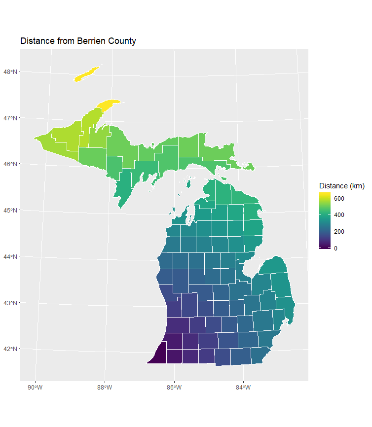

# mapped outputs of distdir_from_point

### packages used 
```r
library(tidyverse)
library(sf)
library(sp)
library(RColorBrewer)
library(geosphere)
library(viridis)
library(viridisLite)
```

### getting the counties & tracts prepared
```r
#### loading data ####
# data was in same folder as r project
tractsMI <- st_read(dsn = "censusMI.gpkg", layer = "tracts")
chicago <- st_read(dsn = "chicago.gpkg", layer = "tracts2010")
chicagoCBD <- st_read(dsn = "chicago.gpkg", layer = "CBD")

#### getting counties & tracts ####
tracts2 <- tractsMI %>%
  # making factors characters to make them easier to work with
  mutate(fips = as.character(COUNTYFP))

# counties divided into tracts
delta <- tracts2[tracts2$fips == "041", ]
berrien <- tracts2[tracts2$fips == "021", ]
gogebic <- tracts2[tracts2$fips == "053", ]
ontonagon <- tracts2[tracts2$fips == "131", ]
charlevoix <- tracts2[tracts2$fips == "029", ]
alger <- tracts2[tracts2$fips == "003", ]
washtenaw <- tracts2[tracts2$fips == "161", ]
keweenaw <- tracts2[tracts2$fips == "083", ]

# undivided counties
countiesMI <- tracts2 %>%
  group_by(fips) %>%
  summarize
delta <- countiesMI[countiesMI$fips == "041", ]
berrien <- countiesMI[countiesMI$fips == "021", ]
gogebic <- countiesMI[countiesMI$fips == "053", ]
ontonagon <- countiesMI[countiesMI$fips == "131", ]
charlevoix <- countiesMI[countiesMI$fips == "029", ]
alger <- countiesMI[countiesMI$fips == "003", ]
washtenaw <- countiesMI[countiesMI$fips == "161", ]
keweenaw <- countiesMI[countiesMI$fips == "083", ]
```

### making the maps 
[distance of counties from berrien county](images/countyBerrien.png)

```r
distdir_from_point(center = berrien,
                   layer = countiesMI,
                   prefix = "cbd") %>%
  mutate("Distance (km)" = cbd_dist_double / 1000) %>%
  ggplot() +
  geom_sf(aes(fill = `Distance (km)`),
          color = "white") +
  scale_fill_viridis() +
  labs(title = "Distance from Berrien County")
  ```
