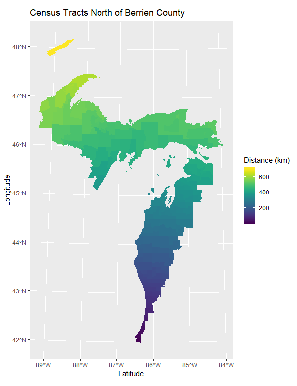
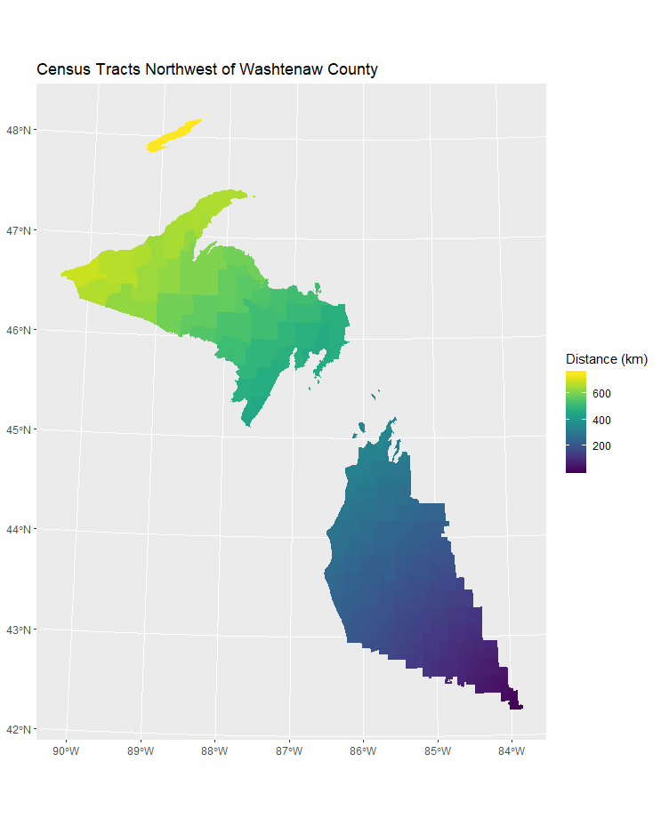
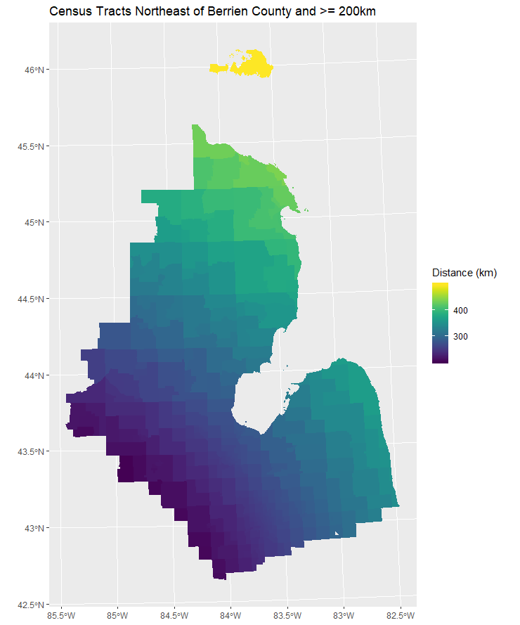
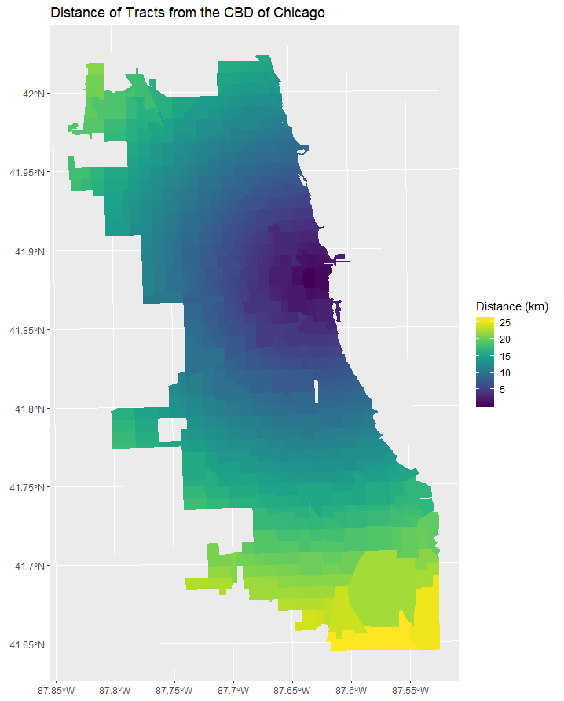

# mapping outputs of `distdir_from_point`

### packages used 
```r
library(tidyverse)
library(sf)
library(sp)
library(RColorBrewer)
library(geosphere)
library(viridis)
library(viridisLite)
```

### getting the counties & tracts prepared
```r
#### loading data ####
# data was in same folder as r project
tractsMI <- st_read(dsn = "censusMI.gpkg", layer = "tracts")
chicago <- st_read(dsn = "chicago.gpkg", layer = "tracts2010")
chicagoCBD <- st_read(dsn = "chicago.gpkg", layer = "CBD")

#### getting counties & tracts ####
tracts2 <- tractsMI %>%
  # making factors characters to make them easier to work with
  mutate(fips = as.character(COUNTYFP))

# counties divided into tracts
delta <- tracts2[tracts2$fips == "041", ]
berrien <- tracts2[tracts2$fips == "021", ]
gogebic <- tracts2[tracts2$fips == "053", ]
ontonagon <- tracts2[tracts2$fips == "131", ]
charlevoix <- tracts2[tracts2$fips == "029", ]
alger <- tracts2[tracts2$fips == "003", ]
washtenaw <- tracts2[tracts2$fips == "161", ]
keweenaw <- tracts2[tracts2$fips == "083", ]

# undivided counties
countiesMI <- tracts2 %>%
  group_by(fips) %>%
  summarize
delta <- countiesMI[countiesMI$fips == "041", ]
berrien <- countiesMI[countiesMI$fips == "021", ]
gogebic <- countiesMI[countiesMI$fips == "053", ]
ontonagon <- countiesMI[countiesMI$fips == "131", ]
charlevoix <- countiesMI[countiesMI$fips == "029", ]
alger <- countiesMI[countiesMI$fips == "003", ]
washtenaw <- countiesMI[countiesMI$fips == "161", ]
keweenaw <- countiesMI[countiesMI$fips == "083", ]
```

### [maps made using ggplot2](r/mapping.R)
#### quick note:
These maps were made with the `distdir_from_point` function that had layer and center as arguments rather than input and origin. 

#### [distance of counties from berrien county, michigan](images/countyBerrien.png)

```r
distdir_from_point(center = berrien,
                   layer = countiesMI,
                   prefix = "ber") %>%
  mutate("Distance (km)" = ber_dist_double / 1000) %>%
  ggplot() +
  geom_sf(aes(fill = `Distance (km)`),
          color = "white") +
  scale_fill_viridis() +
  labs(title = "Distance from Berrien County")
  ```
  
#### [distance of tracts from gogebic county, michigan](images/gogebic.png)

```r
distdir_from_point(center = gogebic,
                   layer = tractsMI,) %>%
  mutate("Distance (km)" = dist_double / 1000) %>%
  ggplot() +
  geom_sf(aes(fill = `Distance (km)`),
          color = NA) +
  scale_fill_viridis() +
  labs(title = "Distance of Census Tracts from Gogebic County",
       x = "Longitude",
       y = "Latitude")
```
  
#### [census tracts north of berrien county, michigan](images/northBerrien.png)
  
 ```r
 distdir_from_point(center = berrien,
                   layer = tractsMI,
                   prefix = "ber") %>%
  mutate("Distance (km)" = ber_dist_double / 1000) %>%
  filter(ber_card_ord == "N") %>%
  ggplot() +
  geom_sf(aes(fill = `Distance (km)`),
          color = NA) +
  scale_fill_viridis() +
  labs(title = "Census Tracts North of Berrien County",
       x = "Longitude",
       y = "Latitude")
```

#### [census tracts northwest of washtenaw county, michigan](images/washtenaw.png)

```r
distdir_from_point(center = washtenaw,
                   layer = tractsMI,
                   prefix = "wa") %>%
  mutate("Distance (km)" = cbd_dist_double / 1000) %>%
  filter(wa_card_ord == "NW") %>%
  ggplot() +
  geom_sf(aes(fill = `Distance (km)`),
          color = NA) +
  scale_fill_viridis() +
  labs(title = "Census Tracts Northwest of Washtenaw County")
 ```
#### [census tracts northeast of berrien county and further than 200 km away](images/northeastBerrien.png)

```r
distdir_from_point(center = berrien,
                   layer = tractsMI,
                   prefix = "ber") %>%
  mutate("Distance (km)" = ber_dist_double / 1000) %>%
  filter(ber_card_ord == "NE" & `Distance (km)` >= 200) %>%
  ggplot() +
  geom_sf(aes(fill = `Distance (km)`),
          color = NA) +
  scale_fill_viridis() +
  labs(title = "Census Tracts Northeast of Berrien County and >= 200km")
```

#### [distance of tracts  from the central business district of chicago, illinois](images/chicagoDist.png)

```r
distdir_from_point(center = chicagoCBD,
                   layer = chicago,
                   prefix = "cbd") %>%
  mutate("Distance (km)" = cbd_dist_double / 1000) %>%
  ggplot() +
  geom_sf(aes(fill = `Distance (km)`),
          color = NA) +
  scale_fill_viridis() +
  labs(title = "Distance of Tracts from the CBD of Chicago")
  ```
