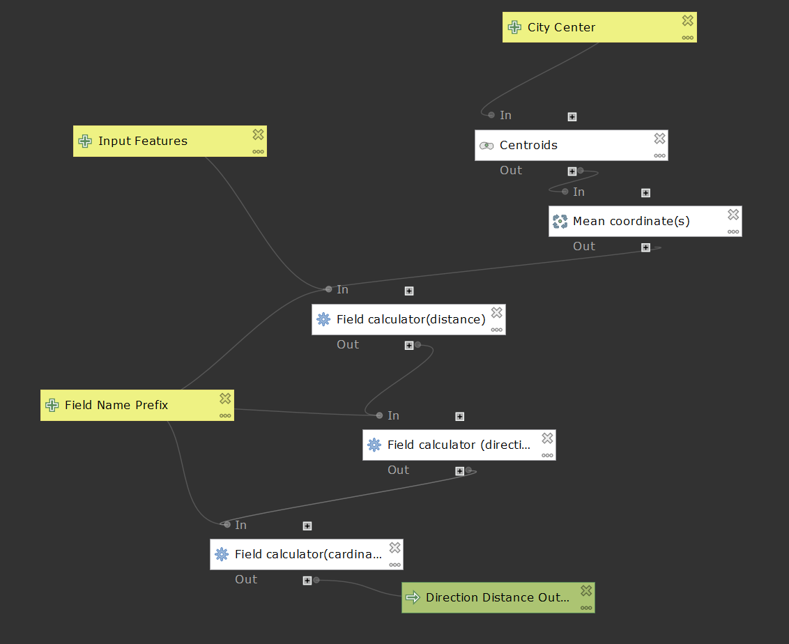
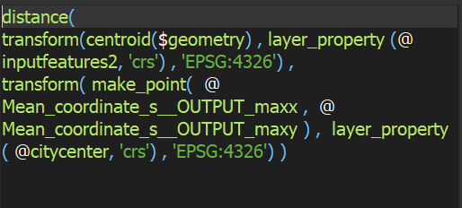
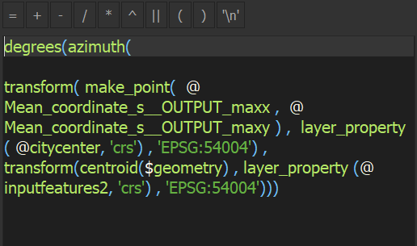
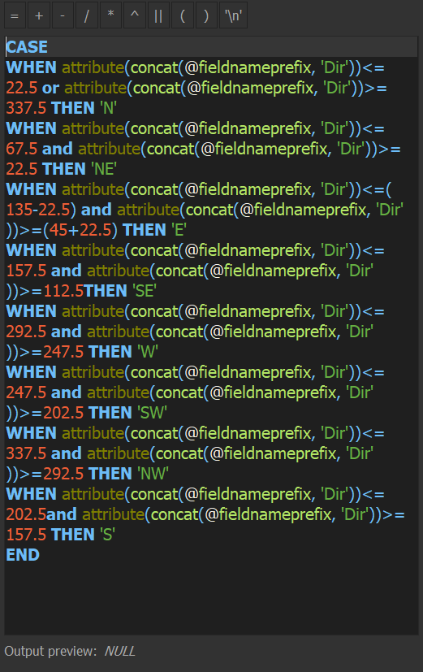
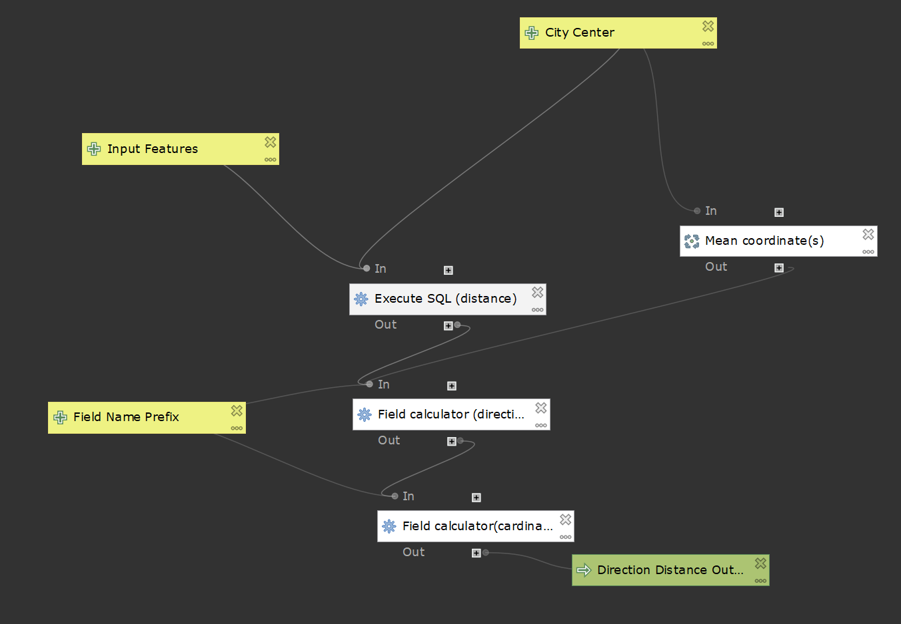
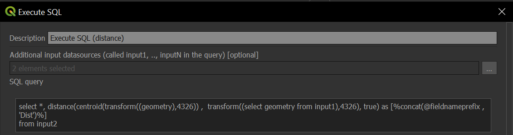
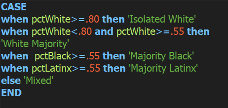

# qgis modeling

### about
Using the QGIS Processing Modeler, I created models which can be used in QGIS to calculate distance and direction from a given point. The intended application of the model is to calculate the distance and direction of features within a city from the city center or central business district, though the models’ use is not limited to this scenario. The models, maps and graphs which display outputs of the model, as well as the data and .qgz file used to employ the models can be found towards the bottom of this page. 

### what does it matter?
QGIS and other open source GIS software allow users to truly adopt GIS as their own, and through the making of this model, I have attempted to do the same. GIS is far from being a singular technology along a singular path, and the opening of this technology, the possibilities it presents to users as well as the implications it has on human geography, is something to be welcomed with open arms.  

St Martin, K., & Wing, J. (2007). The Discourse and Discipline of GIS. Cartographica, 42, 235–248. [https://doi.org/10.3138/carto.42.3.235]( https://doi.org/10.3138/carto.42.3.235)

### how the models work and shortcomings
#### original model

#### calculating distance with field calculator 

Distance is calculated using the distance() function within the field calculator. The distance between centroids created on the input features and a point made from the mean x and y coordinates of the city center input is what is calculated. Before the distance is calculated, both points are transformed to WGS 84, the World Geodetic System 1984, to ensure that distance is accurately calculated and to prevent errors which may arise from using the CRS of the input features. Due to the function Layer_Properties() not being designed for use in models, the intended functionality of the original model to allow for users to create a point to be used as the city center from selected features, although it worked initially, now results in null values. The model also calculates distance in decimal degrees rather than in meters as intended. This is because the distance() function does not currently support geodesic calculations in linear units, such as in meters. The centroid tool is of no use in the model, though it remains in the original. Mean Coordinates, as stated before, are still used in the model. The names of all fields created with the model are concatenated with the customizable field prefix. For example, if one was to input ‘test’ as the field name prefix, the field created for distance would be named testDist. This allows for flexible field names and prevents duplication.

#### calculating direction with field calculator

Direction is calculated using the azimuth() function. Direction is calculated from a point made using the mean x and y coordinates of the city center to centroids created on the input features. Like when calculating distance, the geometries used here are transformed to a different CRS in order to accurately calculate direction and prevent error. Unlike when calculating distance, however, the geometries are transformed to World Mercator. Since azimuth() calculates direction in radians, the degrees() is used in the calculation to convert direction from radians to degrees.  

#### assigning cardinal and ordinal direction to degree ranges with field calculator

The results from the direction field calculation are divided into 22.5° sectors and assigned cardinal and ordinal in this field calculation using the CASE expression. The attribute() function returns In the case of this calculation, attribute() returned the name of the field direction field, concat(@fieldnameprefix, ‘Dir’). The name of the field is the concat() function used to concatenate the customizable field name prefix with Dir, a shortened name for direction.  

### sql version

#### calculating distance with execute sql

This model differs from the original with its use of the Execute SQL tool to calculate distance. Input1 is the city center while input2 are the input features seen in the model above. Geodesic calculations in linear units are supported by Execute SQL. Using 'true' in the query results in distance being calculated in meters rather than degrees. Both features are transformed to WGS 1984 to ensure that distance is accurately calculated and to prevent errors which may arise from using the CRS of the input features. Despite Mean Coordinates not being used to calculate distance, it is kept in this model solely because the direction calculation would not function without it. For whatever reason I was unable to use the input from City Center to calculate direction, so the model still uses the mean coordinates of the inputted point to create a point which can be used in the calculation. Although it is redundant, it works. The centroid tool, however, was removed from the model because of its redundancy. The calculation for cardinal and ordinal direction remained the same. Because the city center point cannot be created within the model from selected features and be used in the calculation, I created another model with the singular purpose of creating points which can be used in the model. The model makes centroids on inputted features, which in this model can be selected features, finds the mean coordinates of the centroids, and outputs a point. It is essentially the distance/direction model with all calculations for distance and direction removed. 

### models
~~[calculates distance and direction from a point](models/distDirFromPoint.model3)~~ **semi-functional**

[this ***improved*** and ***functional*** version partially uses sql and calculates distance and direction from a point](qgis/qgisModelSQL.md)

### case study using sql model
Using data from the Census, I analyzed the racial composition and gross median rent of census tracts in Wayne County, Michigan. The model aided in the brief study of the spatial distribution of ethnic enclaves within Michigan's most populous county.

#### mapped outputs

#### enclave classification 

Poulsen, M., Johnston, R., & Forrest, J. (2001). Intraurban Ethnic Enclaves: Introducing a Knowledge-Based Classification Method. *Environment and Planning A: Economy and Space*, 33(11), 2071–2082. [https://doi.org/10.1068/a34124](https://doi.org/10.1068/a34124)

#### graphs made using outputs of model

[direction of tracts from detroit cbd in wayne county and percentage white](graphs/pctWhiteWayne.html)

[direction of tracts from detroit cbd in wayne county and percentage black](graphs/pctBlackWayne.html)

[distance (m) of tracts from detroit cbd in wayne county and median gross rent](graphs/medianGrossRentWayne.html)

[direction of tracts from detroid cbd in wayne county and median gross rent](graphs/medianGrossRentDirWayne.html)

#### data
[census tracts for michigan with outputs for kent, washtenaw, and wayne counties](data/censusMI.gpkg)

[qgis project file](data/censusMI.qgz)

Data Sources: U.S. Census Bureau; 2018 Census Tracts for Michigan, 2017 American Community Survey 5-Year Estimates, Tables B25064 and B03002
