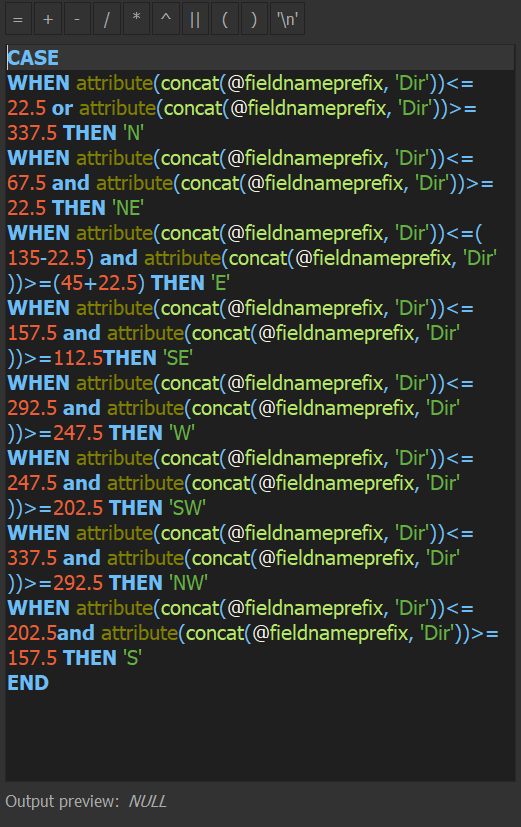

# qgis models

### about
to be completed ~~25.09.2019~~ ~~26.09.2019~~ ***as soon as possible***
### how the models work and shortcomings
#### original model

#### calculating distance with field calculator 

Distance is calculated using the distance() function within the field calculator. The distance between centroids created on the input features and a point made from the mean coordinates of the city center input is what is calculated. Before the distance is calculated, both points are transformed to WGS 84, the World Geodetic System 1984, to ensure that distance is accurately calculated and to prevent errors which may arise from using the CRS of the input features. Due to the function Layer_Properties() not being designed for use in models, the intended functionality of the original model to allow for users to create a point to be used as the city center from selected features, although it worked initially, now results in null values. The model also now calculates distance in decimal degrees rather than meters. The centroid tool is of no use in the model, though it remains in the original. Mean coordinates, as stated before, are still used in caluclating both distance and direction.

#### calculating direction with field calculator

#### assigning cardinal and ordinal direction to degree ranges with field calculator

### sql version

#### calculating distance with execute sql

This model differs from the original with its use of the Execute SQL tool to calculate distance. Input1 is the city center while input2 are the input features seen in the model above. Using 'true' in the query results in distance being calculated in meters rather than degrees. Similar to the original model, both features are transformed to WGS 1984, the World Geodetic System 1984, to ensure that distance is accurately calculated and to prevent errors which may arise from using the CRS of the input features. Despite Mean Coordinates not being used to calculate distance, it is kept in this model solely because the direction calculation would not function without it. For whatever reason I was unable to use the input from City Center to calculate direction, so the model still uses the mean coordinates of the inputted point to create a point which can be used in the calculation. Although it is redundant, it works. The centroid tool, however, was removed from the model because of its redundancy. The calculation for cardinal and ordinal direction remained the same. Because the city center point cannot be created within the model from selected features and be used in the calculation, I created another model with the singular purpose of creating points which can be used in the model. The model makes centroids on inputted features, which in this model can be selected features, finds the mean coordinates of the centroids, and outputs a point. It is essentially the distance/direction model with all calculations for distance and direction removed. 

### models
~~[calculates distance and direction from a point](distDirFromPoint.model3)~~ **semi-functional**

[this improved and ***functional*** version partially uses sql and calculates distance and direction from a point](qgisModelSQL.md)

### mapped outputs

*Data Sources: U.S. Census Bureau;2018 Census Tracts for Michigan, 2017 American Community Survey 5-Year Estimates, Tables B25064 and B03002*
### graphs made using outputs of models

[direction of tracts from detroit cbd in wayne county and percentage white](pctWhiteWayne.html)

[direction of tracts from detroit cbd in wayne county and percentage black](pctBlackWayne.html)

[distance (m) of tracts from detroit cbd in wayne county and median gross rent](medianGrossRentWayne.html)

### data
[census tracts for michigan with outputs for kent, washtenaw, and wayne counties](censusMI.gpkg)

[qgis project file](censusMI.qgz)
