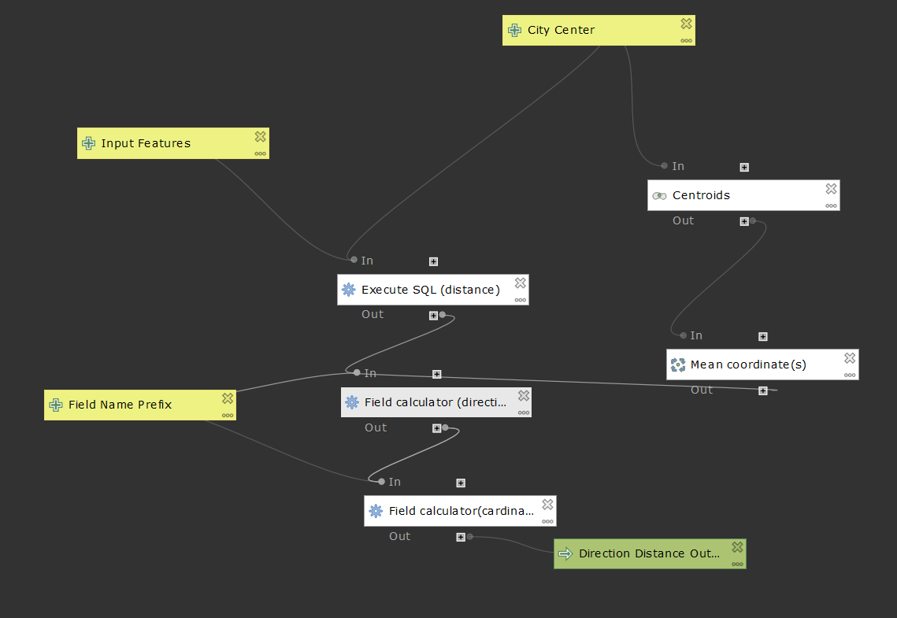

# qgis models
### about
to be completed ~~25.09.2019~~ 26.09.2019 (hopefully)

### how the models work and shortcomings
#### orginal model

#### sql version

### models
[calculates distance and direction from a point](distDirFromPoint.model3)

[this version calculates distance using sql](qgisModelSQL.md)

### graphs made using outputs of models

[direction of tracts from detroit cbd in wayne county and percentage white](pctWhiteWayne.html)

[direction of tracts from detroit cbd in wayne county and percentage black](pctBlackWayne.html)

[distance (m) of tracts from detroit cbd in wayne county and median gross rent](medianGrossRentWayne.html)

### data
[census tracts for michigan with outputs for kent, washtenaw, and wayne counties](censusMI.gpkg)

