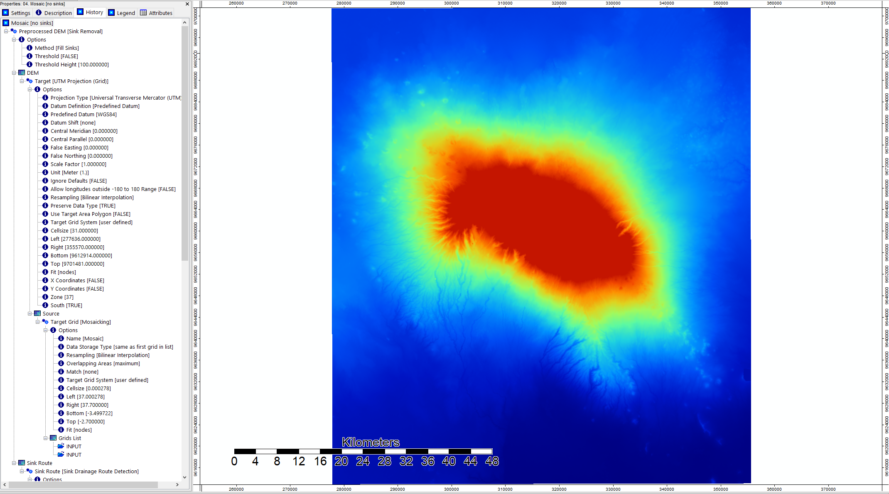
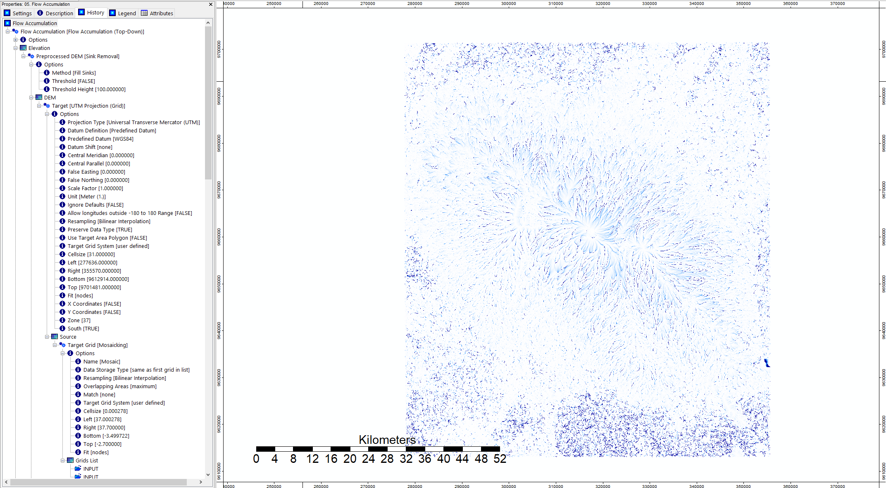
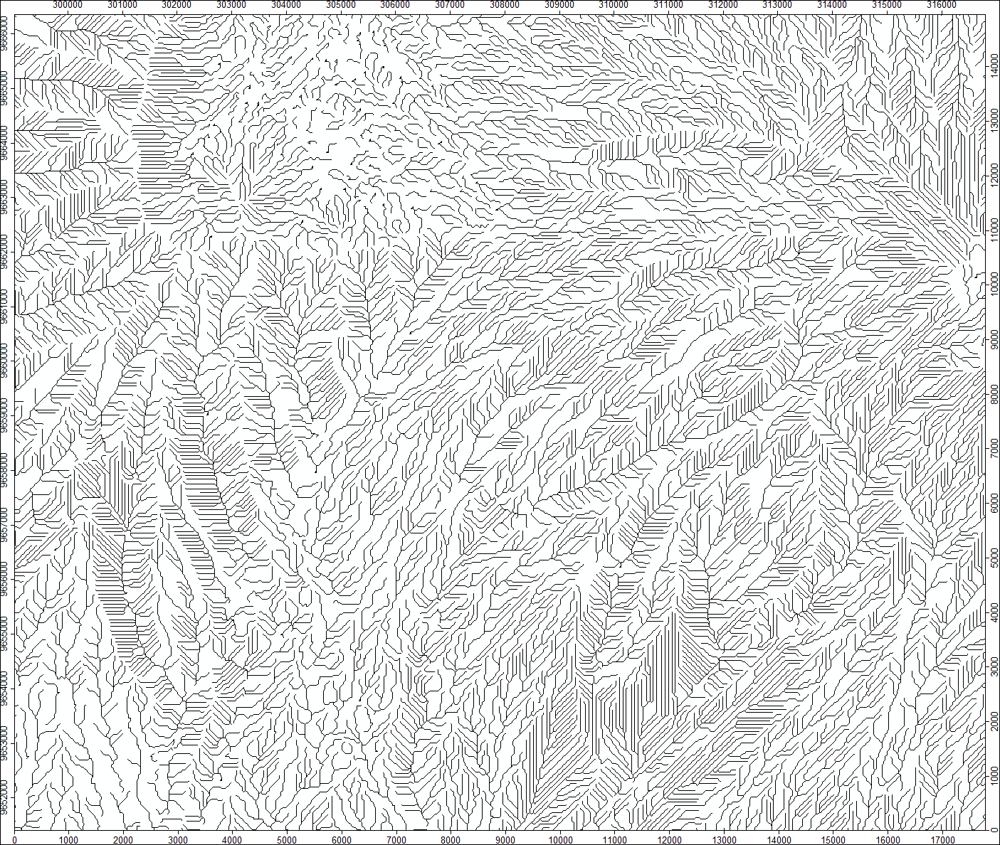
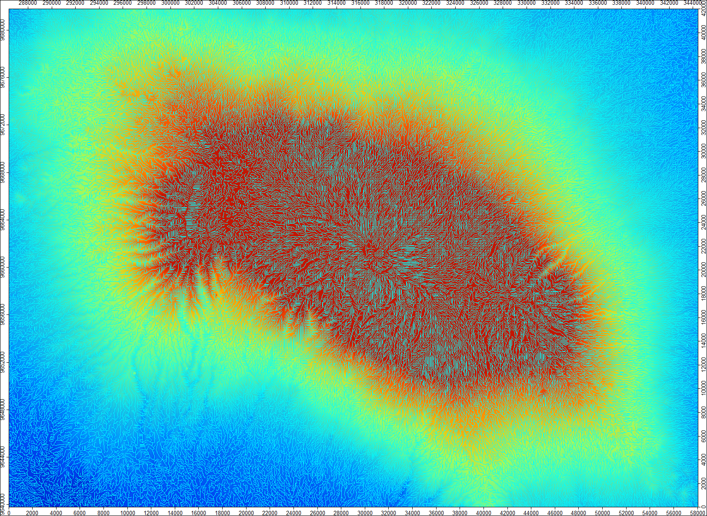
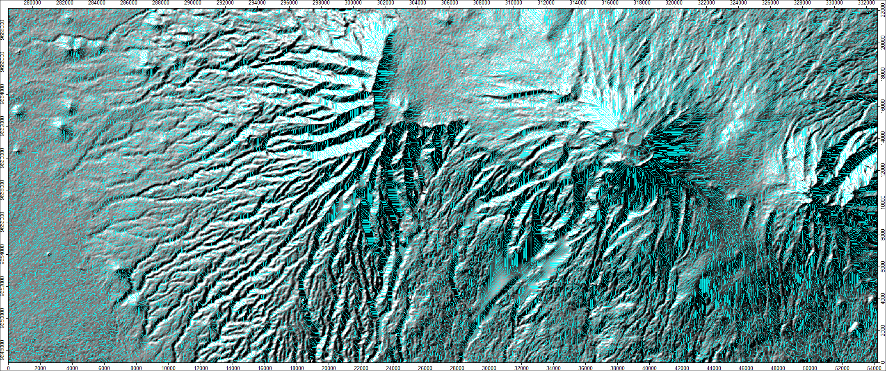

# saga
### hydrology analysis of kilimanjaro
SAGA was used in this project to derive channel networks and other terrain products from global elevation models obtained from NASA’s Shuttle Radar Topography Mission. Shown below are the steps taken to process the data. Zip files with tool outputs can also be found on this page. 

#### opening data in saga

#### creating a mosaic using mosaicking tool and reprojecting in utm

#### making a hillshade from mosaic for visualization

#### finding sink routes in mosaic using sink drainage route dectection tool

##### close-up image

#### removing sinks from mosaic using sink removal tool

#### flow accumulation (top-down)

#### using flow accumulation to create a channel network

##### close-up of channel network in black

##### channel network overlaid on mosaic

##### hillshade and channel network

### data source
NASA JPL. NASA Shuttle Radar Topography Mission Global 1 arc second. 2013, distributed by NASA EOSDIS Land Processes DAAC, [https://doi.org/10.5067/MEaSUREs/SRTM/SRTMGL1.003]( https://doi.org/10.5067/MEaSUREs/SRTM/SRTMGL1.003)

### data (.sgrid)
[SRTM tiles](data/rawData.zip)

[mosaic projected in UTM](data/mosaicUTM.zip)

[analytical hillshade](data/hillshade.zip)

[sink route detection](data/sinkRoute.zip)

[mosaic with sinks removed](data/mosaicNoSinks.zip)

[flow accumulation](data/flowAccumulation.zip)

[channel network (.sgrid and shapefile)](data/channelNetwork.zip)

