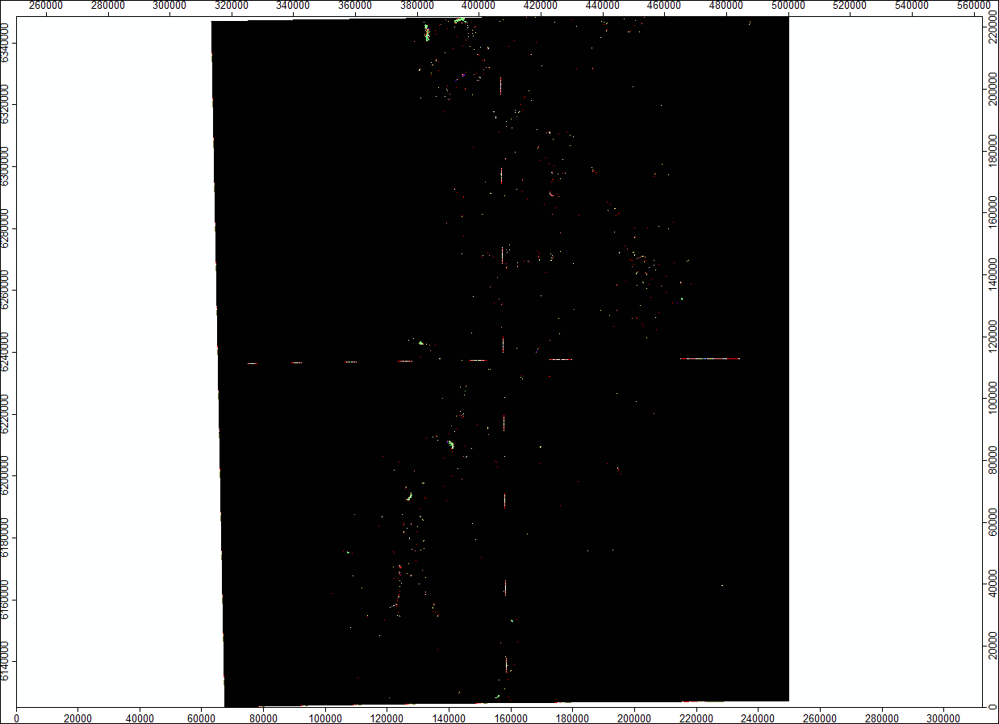
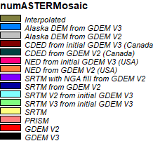
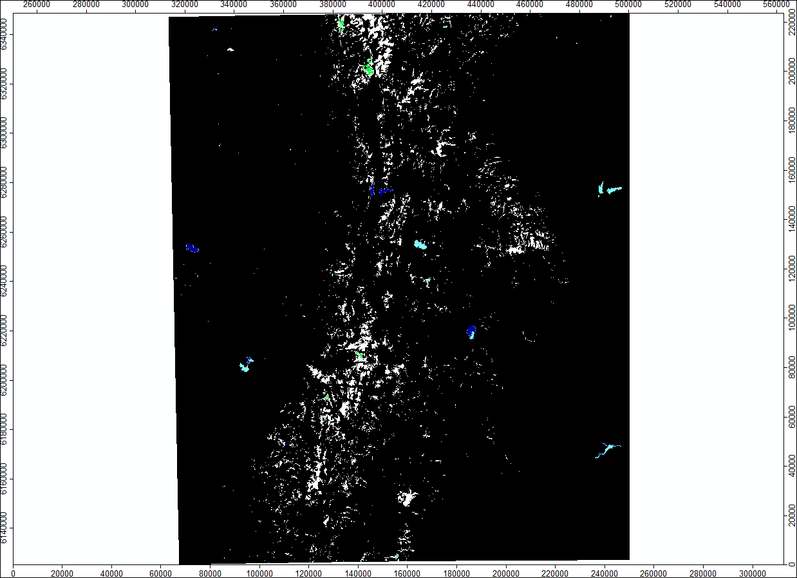
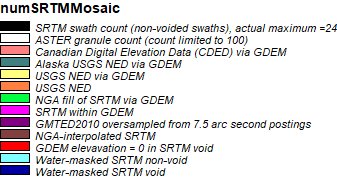
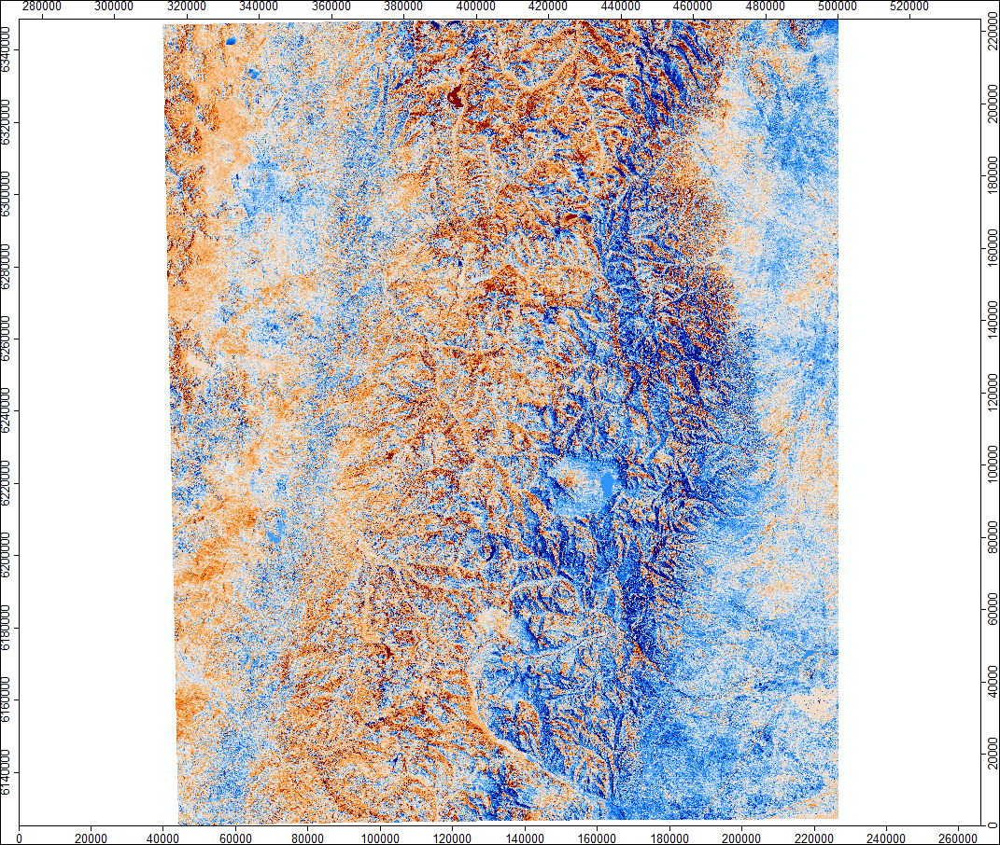
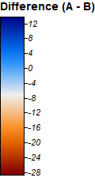

# comparing aster & srtm data for andes mountains 
### visualizations of .num files
#### aster

#### srtm

### difference between aster and srtm mosaic 

### files

#### unedited num

#### num files in utm and .sgrd

