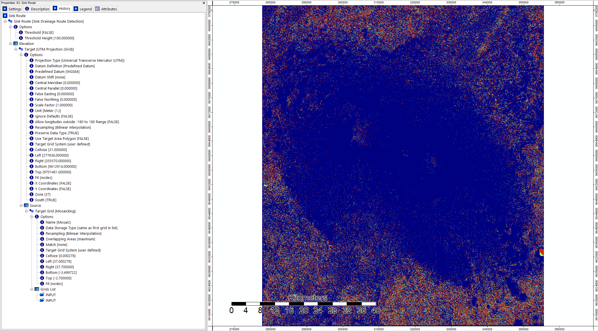

# saga
### terrain analysis of kilimanjaro
Data: NASA JPL. NASA Shuttle Radar Topography Mission Global 1 arc second. 2013, distributed by NASA EOSDIS Land Processes DAAC, [https://doi.org/10.5067/MEaSUREs/SRTM/SRTMGL1.003]( https://doi.org/10.5067/MEaSUREs/SRTM/SRTMGL1.003)

#### opening data in saga

#### creating a mosaic using mosaicking tool and reprojecting in utm

#### making a hillshade from mosaic for visualization

#### finding sink routes in mosaic using sink drainage route dectection tool

##### close-up image

#### removing sinks from mosaic using sink removal tool

#### flow accumulation (top-down)

#### using flow accumulation to create a channel network

##### close-up of channel network in black

##### channel network overlaid on mosaic

