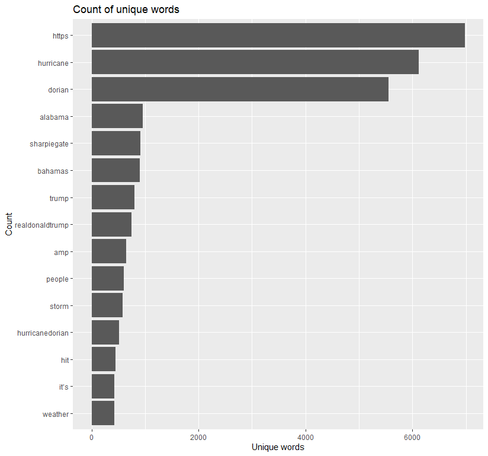
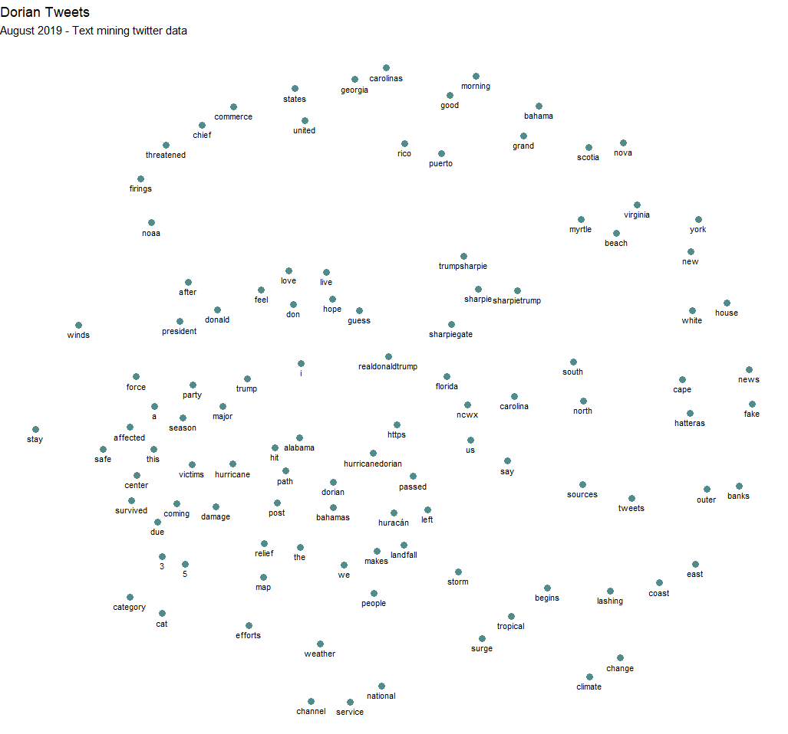
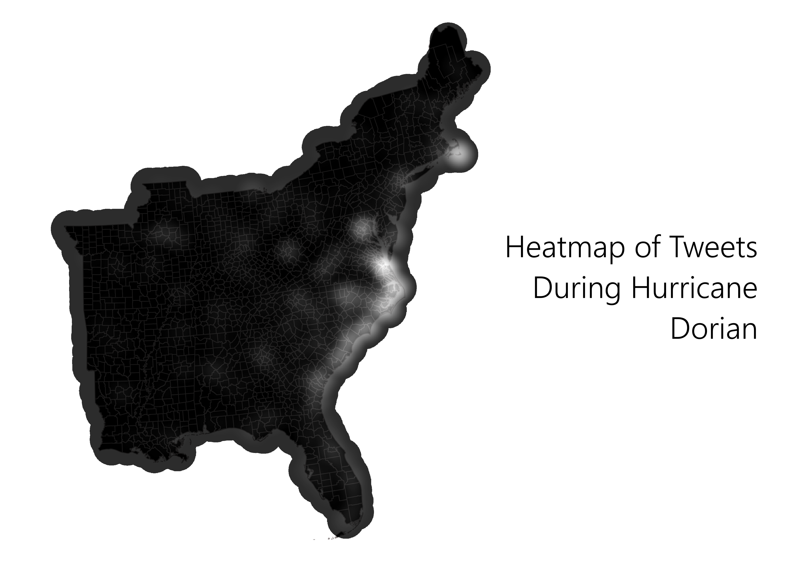
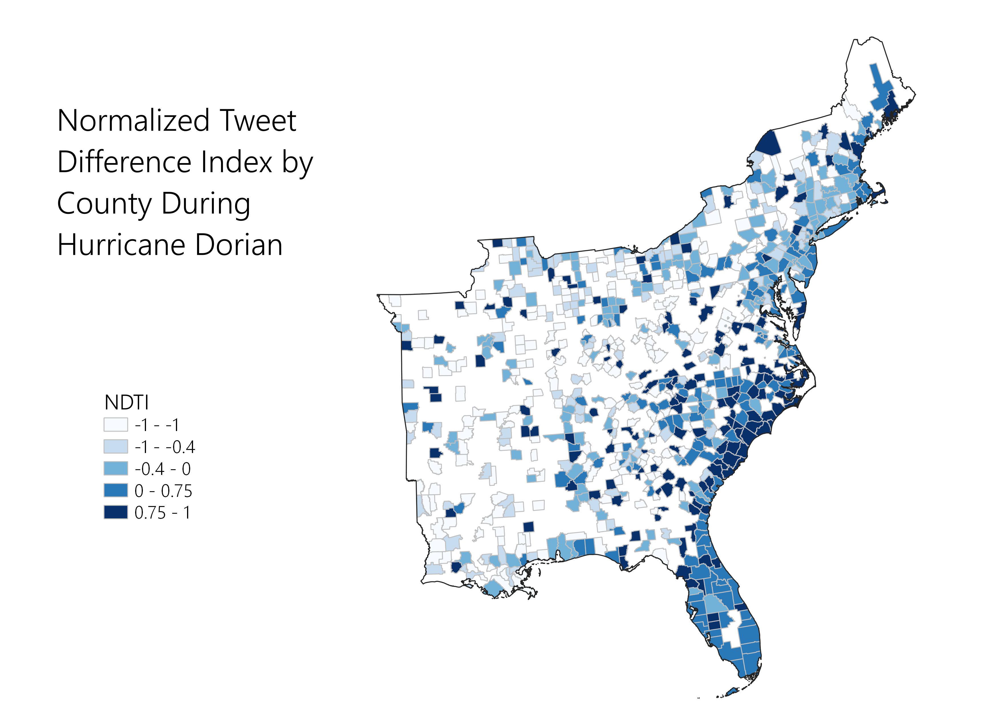
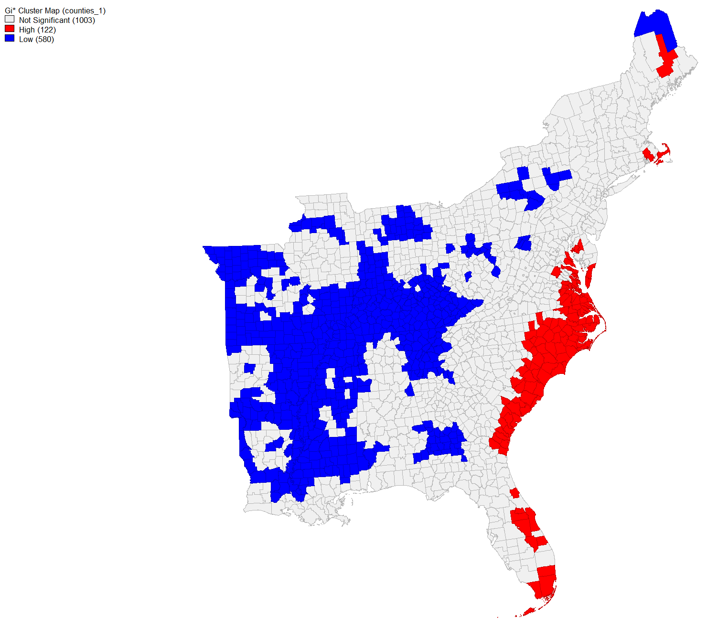
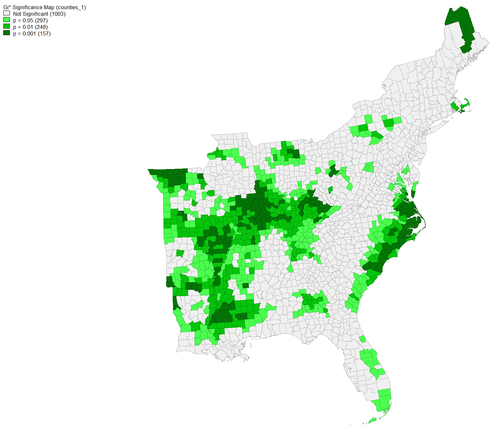

# analysis of tweets during hurricane dorian using r and postgis 
### about
RStudio, QGIS, and GeoDa were used in this lab to analyze tweets to see if either a glaringly doctored hurricane map (SharpieGate) or the actual path of Hurricane Dorian drove more Twitter activity during the storm. 

### textual analysis of tweets
[This script](dorianTwitterScript.R) was written by Professor Holler and was used to search and download geographic Twitter data for Hurricane Dorian. This script resulted in two data frames: dorian, which  contains tweets about Hurricane Dorian, and november, which contains  
After the the tweets were taken from the 


```r
dorianWords %>%
  count(word, sort = TRUE) %>%
  top_n(15) %>%
  mutate(word = reorder(word, n)) %>%
  ggplot(aes(x = word, y = n)) +
  geom_col() +
  xlab(NULL) +
  coord_flip() +
  labs(x = "Count",
       y = "Unique words",
       title = "Count of unique words")
```

``` r
dorianWordPairs %>%
  filter(n >= 30) %>%
  graph_from_data_frame() %>%
  ggraph(layout = "fr") +
  # geom_edge_link(aes(edge_alpha = n, edge_width = n)) +
  # hurricane and dorian occur the most together
  geom_node_point(color = "darkslategray4", size = 3) +
  geom_node_text(aes(label = name), vjust = 1.8, size = 3) +
  labs(title = "Dorian Tweets",
       subtitle = "August 2019 - Text mining twitter data ",
       x = "", y = "") +
  theme_void()
```

### uploading data to postgis database and continuing analysis 
After using R and RStudio to conduct texual analysis of the tweets TidyCensus was used to get 



### spatial statistics with geoda 
After all this was done, I opened GeoDa, connected to my database and loaded the counties table into the program. 



